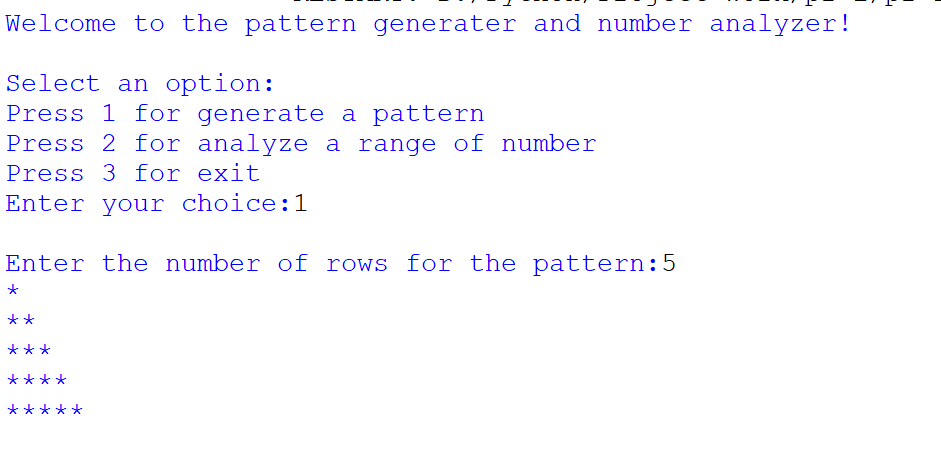
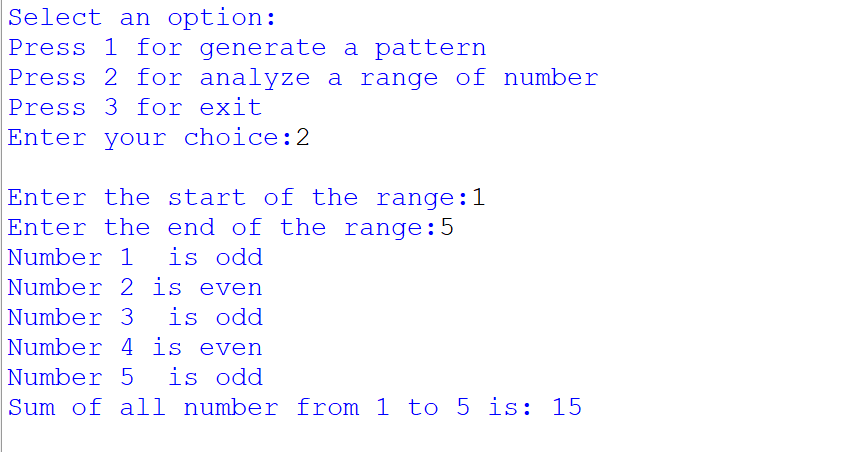
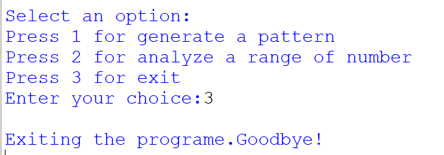

# 🌟 Pattern Generator & Number Analyzer 🌟

<div align="center">

# 🎨 Python Mini Project 🎨



### 🚀 Beginner Friendly Python Project 🚀

</div>

---

# 📖 About Project

This is a simple and interactive **Python console application** made using:

- 🔹 Loops
- 🔹 Match Case
- 🔹 Conditional Statements
- 🔹 Nested Loops
- 🔹 User Input

The program allows users to:

✅ Generate star patterns  
✅ Analyze odd and even numbers  
✅ Calculate sum of numbers  
✅ Exit the program safely  

---

# 🖼️ Output Screenshots

## ⭐ Pattern Generator Output

<div align="center">


</div>

---

## 🔢 Number Analyzer Output

<div align="center">



</div>

---

## 🚪 Exit Program Output

<div align="center">



</div>

---

# 💻 Python Code

```python
print("Welcome to the pattern generater and number analyzer!")

while True:

    print("\nSelect an option:")

    print("Press 1 for generate a pattern")
    print("Press 2 for analyze a range of number")
    print("Press 3 for exit")

    choice=int(input("Enter your choice:"))

    match choice:

        case 1:

            row=int(input("\nEnter the number of rows for the pattern:"))

            for i in range (1,row+1,+1):

                for j in range (1,i+1,+1):

                    print("*",end="")

                print("")

        case 2:

            start=int(input("\nEnter the start of the range:"))
            end=int(input("Enter the end of the range:"))

            sum=0

            for i in range (start,end+1,+1):

                if i%2==0:
                    print("Number",i,"is even")

                else :
                    print("Number",i," is odd")

                sum=sum+i

            print("Sum of all number from",start,"to",end,"is:",sum)

        case 3:

            print("\nExiting the programe.Goodbye!")

            break
```

---

# ✨ Features

| Feature | Description |
|---------|-------------|
| ⭐ Pattern Generator | Prints star triangle patterns |
| 🔢 Number Analyzer | Checks odd and even numbers |
| ➕ Sum Calculator | Finds total sum of range |
| 🚪 Exit Option | Closes the application safely |

---

# 🚀 How To Run

## 📌 Step 1

Install Python on your computer.

---

## 📌 Step 2

Save the file as:

```bash
main.py
```

---

## 📌 Step 3

Run the program:

```bash
python main.py
```

---

# 📂 Project Structure

```text
📁 Pattern-Generator-And-Analyzer
 ┣ 📄 main.py
 ┣ 📄 README.md
 ┣ 🖼️ Pattern Output Image
 ┣ 🖼️ Number Analyzer Image
 ┗ 🖼️ Exit Output Image
```

---

# 💡 Future Improvements

- 🌈 Add colorful terminal output
- 🖥️ Create GUI version using Tkinter
- 📊 Add more pattern styles
- 🧠 Better error handling
- ✨ Improve user interface

---

# ❤️ Made With Python

<div align="center">

## 👨‍💻 Created For Practice & Learning

⭐ Don't forget to star this project ⭐

</div>
