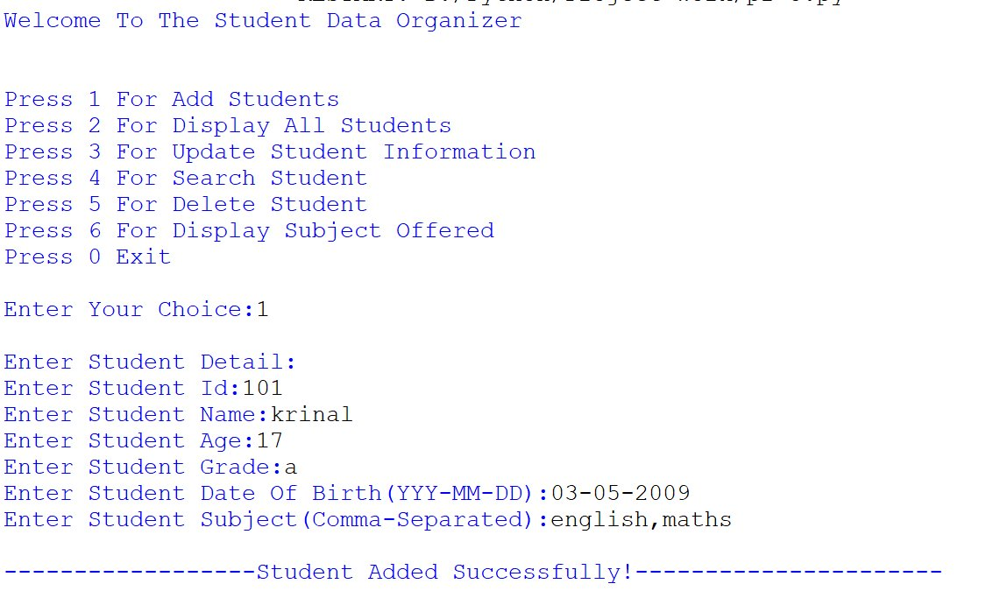
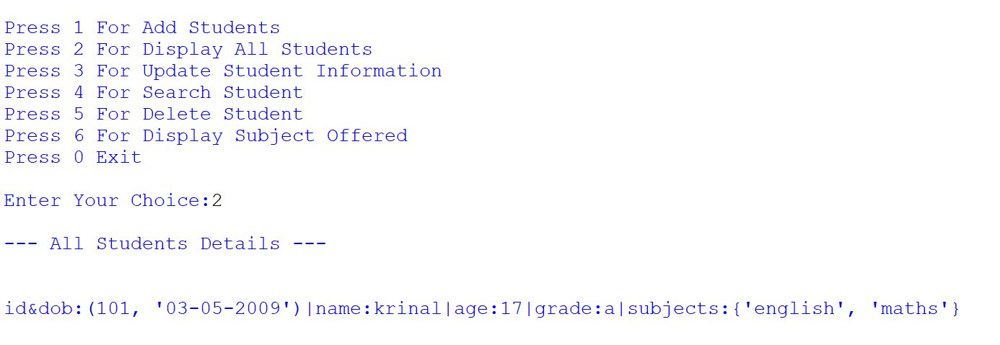
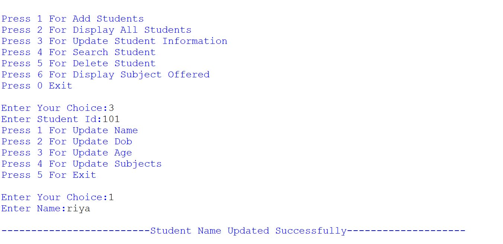
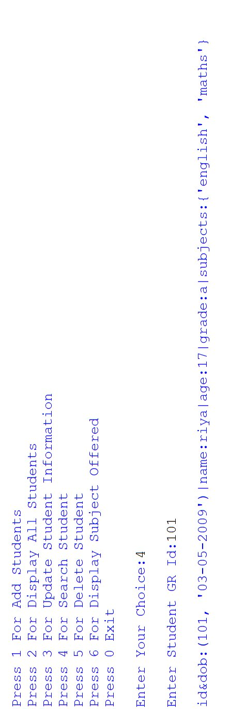
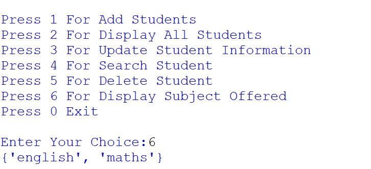
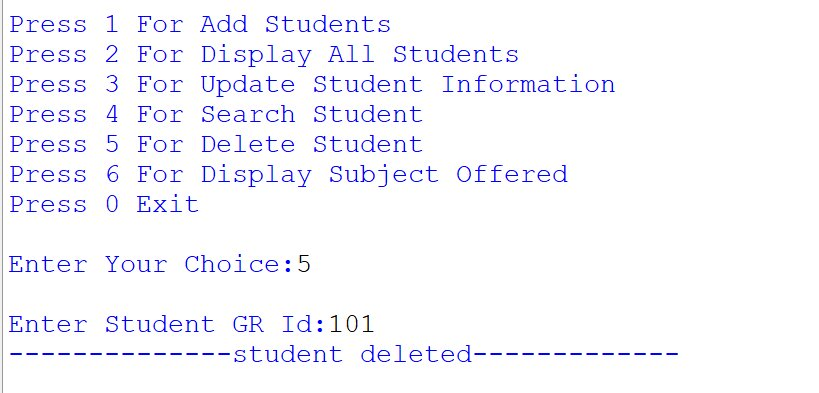
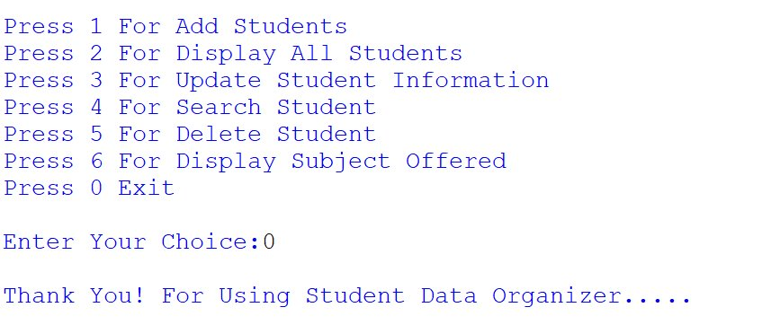

<div align="center">

# 🎓 -- ! Student Data Organizer ! --
### *Interactive Console-Based Student Management System*

[](https://www.python.org/)
[](https://www.python.org/)
[](https://www.python.org/)
[](https://www.python.org/)

<br/>

> *"Data is the new soil — organize it well, and knowledge will grow."*

</div>

---

## 📋 Table of Contents

- [📌 Overview](#-overview)
- [🎯 Problem Statement](#-problem-statement)
- [✨ Key Features](#-key-features)
- [🏗️ Project Structure](#️-project-structure)
- [🔄 Project Workflow](#-project-workflow)
- [🗂️ Data Structure Design](#️-data-structure-design)
- [⚙️ Functionality Breakdown](#️-functionality-breakdown)
- [🖥️ Program Output Screenshots](#️-program-output-screenshots)
- [🛠️ Tech Stack](#️-tech-stack)
- [📈 Results & Insights](#-results--insights)
- [🏆 Advantages](#-advantages)
- [📄 License](#-license)
- [👤 Author](#-author)
- [🙏 Acknowledgements](#-acknowledgements)

---

## 📌 Overview

The **Student Data Organizer** is a beginner-friendly, interactive Python console application designed to manage student records efficiently using Python's core data structures — **lists**, **dictionaries**, **tuples**, and **sets**. The program runs in a continuous loop, presenting a menu-driven interface for full CRUD operations on student data.

This project is designed to:
- Strengthen understanding of Python **data structures** (list, dict, tuple, set)
- Practice **menu-driven program design** using `match-case`
- Apply **CRUD operations** — Create, Read, Update, Delete on student records
- Demonstrate **subject management** using Python sets

---

## 🎯 Problem Statement

> **Objective:** Build a console-based interactive tool to store, display, update, search, and delete student records.

You are building a student management utility for educational use. The program must accept user choices from a menu and execute the corresponding task — adding students, viewing all records, updating information, searching by ID, deleting records, or displaying all offered subjects.

| 📂 Feature | 📄 Type | 🔍 Description |
|------------|---------|----------------|
| Add Student | Create | Stores student info including ID, name, age, grade, DOB, subjects |
| Display All | Read | Prints all stored student records |
| Update Info | Update | Modify name, DOB, age, or subjects of a student |
| Search Student | Read | Find student by GR ID |
| Delete Student | Delete | Remove a student record from the list |
| Display Subjects | Read | Show all unique subjects across all students |

The goal is to demonstrate **fundamental Python data structure skills** through a clean, menu-driven interactive program.

---

## ✨ Key Features

| Feature | Description |
|--------|-------------|
| 🔁 **Infinite Menu Loop** | Program runs continuously until user selects Exit (0) |
| ➕ **Add Student** | Stores complete student data including tuple for ID+DOB and set for subjects |
| 📋 **Display All Students** | Lists all student records in a formatted view |
| ✏️ **Update Information** | Sub-menu to update name, DOB, age, or subjects individually |
| 🔍 **Search by GR ID** | Finds and displays a student by their unique ID |
| 🗑️ **Delete Student** | Removes a student record from the system |
| 📚 **Display Subjects Offered** | Shows all unique subjects using Python sets |
| 🧩 **Mixed Data Structures** | Uses list (students), dict (student record), tuple (id+dob), set (subjects) |
| 🖥️ **CLI Interface** | Simple, clean text-based menu using `match-case` |

---

## 🏗️ Project Structure

```
📦 student-data-organizer/
│
├── 📄 student_organizer.py     ← Main Python script (entry point)
│
└── 📄 README.md                ← Project documentation
```

---

## 🔄 Project Workflow

```
Program Start
      │
      ▼
┌──────────────────────────────┐
│     Display Main Menu        │  ← Options: 1-6 + Exit (0)
└────────────┬─────────────────┘
             │
   ┌─────────┼──────────────────────┐
   ▼         ▼                      ▼
┌──────┐  ┌──────┐              ┌──────┐
│  1   │  │  2   │   3  4  5 6  │  0   │
│ Add  │  │ View │   ...        │ Exit │
└──┬───┘  └──┬───┘              └──────┘
   │          │
   ▼          ▼
┌──────────────────────────────┐
│   Execute & Print Result     │
└────────────┬─────────────────┘
             │
             ▼
      Loop Back to Menu
             │
      (Choice: 0) Exit ✅
```

---

## 🗂️ Data Structure Design

### 📦 How Student Data is Stored

Each student record uses **4 Python data structures** working together:

```python
student_tuple = (myid, dob)           # Tuple → stores ID + DOB (immutable pair)
subject_set   = set(subject.split(","))  # Set   → unique subjects, no duplicates

student_data = {
    "student_id,dob": student_tuple,  # Dict  → key-value record
    "name":    name,
    "age":     age,
    "grade":   grade,
    "subjects": subject_set
}

students.append(student_data)         # List  → holds all student records
```

| Data Structure | Role | Why Used |
|----------------|------|----------|
| 📋 **List** | Holds all student records | Dynamic — add/remove students |
| 📖 **Dictionary** | Individual student record | Key-value access to fields |
| 🔗 **Tuple** | ID + Date of Birth pair | Immutable — ID shouldn't change |
| 🔵 **Set** | Subjects | No duplicate subjects allowed |

---

## ⚙️ Functionality Breakdown

### ➕ 1. Add Student (Case 1)

Accepts student details and stores them as a structured dictionary inside the `students` list.

```python
case 1:
    myid    = int(input("Enter Student Id:"))
    name    = input("Enter Student Name:")
    age     = input("Enter Student Age:")
    grade   = input("Enter Student Grade:")
    dob     = input("Enter Student Date Of Birth(YYY-MM-DD):")
    subject = input("Enter Student Subject(Comma-Separated):")

    student_tuple = (myid, dob)
    subject_set   = set(subject.split(","))
    student_data  = {
        "student_id,dob": student_tuple,
        "name": name, "age": age,
        "grade": grade, "subjects": subject_set
    }
    students.append(student_data)
```

---

### 📋 2. Display All Students (Case 2)

Iterates through all records and prints formatted student information.

```python
case 2:
    for i in students:
        print(f"id&dob:{i['student_id,dob']}|name:{i['name']}|age:{i['age']}|grade:{i['grade']}|subjects:{i['subjects']}")
```

---

### ✏️ 3. Update Student Information (Case 3)

Provides a sub-menu to update any single field of a matched student.

```python
case 3:
    stu_id = int(input("Enter Student Id:"))
    # Sub-menu: Update Name / DOB / Age / Subjects
    match up_choice:
        case 1: i['name'] = input("Enter Name:")
        case 2: i['student_id,dob'] = input("Enter Dob:")
        case 3: i['age'] = input("Enter Age:")
        case 4: i['subjects'] = input("Enter Subjects")
```

---

### 🔍 4. Search Student (Case 4)

Searches for a student by their GR ID and displays their complete record.

```python
case 4:
    search = int(input("Enter Student GR Id:"))
    for i in students:
        if search == i["student_id,dob"][0]:
            print(f"id&dob:{i['student_id,dob']}|name:{i['name']}|...")
```

---

### 🗑️ 5. Delete Student (Case 5)

Removes a student record from the list.

```python
case 5:
    del_id = int(input("Enter Student GR Id:"))
    for i in students:
        students.remove(i)
    print("--------------student deleted-------------")
```

---

### 📚 6. Display Subjects Offered (Case 6)

Aggregates all unique subjects from every student using set operations.

```python
case 6:
    s = set()
    for i in students:
        for j in i['subjects']:
            s.add(j)
    print(s)
```

---

## 🖥️ Program Output Screenshots

### 🟢 Output 1 — Add Student (Choice: 1)
> Student details entered and stored successfully.



---

### 🟢 Output 2 — Display All Students (Choice: 2)
> All student records displayed with ID, DOB, name, age, grade, and subjects.



---

### 🟢 Output 3 — Update Student Name (Choice: 3 → Sub-choice: 1)
> Student name updated from "krinal" to "riya" successfully.



---

### 🟢 Output 4 — Search Student (Choice: 4)
> Student found by GR ID 101, full record displayed.



---

### 🟢 Output 5 — Search Result Rotated View
> Alternate view of search result showing full student details.



---

### 🟢 Output 6 — Display Subjects Offered (Choice: 6)
> All unique subjects across all students displayed as a set.



---

### 🟢 Output 7 — Exit Program (Choice: 0)
> Program exits gracefully with a thank you message.



---

## 🛠️ Tech Stack

| Tool | Version | Purpose |
|------|---------|---------|
| 🐍 **Python** | 3.10+ | Core programming language |
| 📋 **List** | Built-in | Store all student records |
| 📖 **Dictionary** | Built-in | Individual student record storage |
| 🔗 **Tuple** | Built-in | Immutable ID + DOB pair |
| 🔵 **Set** | Built-in | Unique subjects collection |
| 🔁 **While Loop** | Built-in | Infinite menu loop control |
| 🔀 **Match-Case** | Python 3.10+ | Clean menu branching |
| 🖨️ **print() / input()** | Built-in | Console I/O and user interaction |
| 📐 **f-strings** | Python 3.6+ | Formatted string output |

---

## 📈 Results & Insights

After running the program, the following operations are demonstrated:

- ✅ **Add Student** — Student record created with mixed data structures (dict + tuple + set)
- 📋 **Display All** — Clean formatted output of all stored student records
- ✏️ **Update Record** — Individual field update via sub-menu
- 🔍 **Search** — Accurate lookup by student GR ID
- 🗑️ **Delete** — Student record removal from list
- 📚 **Subjects Set** — All unique subjects from all students collected using set
- 🔁 **Persistent Menu** — Program loops back after every task until manually exited (0)

---

## 🏆 Advantages

| Advantage | Detail |
|-----------|--------|
| 🎓 **Beginner Friendly** | Core concepts: data structures, loops, I/O in one project |
| 🧩 **Multi Data Structures** | Demonstrates list, dict, tuple, and set in one program |
| 🔄 **Full CRUD** | Complete Create, Read, Update, Delete operations |
| 📚 **Educational** | Great for understanding how Python structures work together |
| 🖥️ **No Dependencies** | Runs with pure Python — no external libraries needed |
| ⚡ **Lightweight** | Single-file script, instantly runnable from any terminal |
| 🧪 **Extensible** | Easy to add file storage, GUI, or database support |
| 📖 **Readable Code** | Clear `match-case` structure makes logic easy to follow |

---

## 📄 License

This project is licensed under the **MIT License** — see the [LICENSE](LICENSE) file for full details.

```
MIT License — Free to use, modify, and distribute with attribution.
```

---

## 👤 Author

<div align="center">

### KRINAL DHOLAKIYA

[](https://github.com/)
[](https://www.linkedin.com/in/)

> *"Every student record tells a story — organize them well and knowledge will never be lost."*

**🎓 Role:** Junior Python Developer | Programming Enthusiast \
**📍 Location:** India\
**🛠️ Skills:** Python · Data Structures · CLI Applications · Logic Building · CRUD Operations

</div>

---

## 🙏 Acknowledgements

Special thanks to the following resources and communities that made this project possible:

- 📚 [Python Official Docs](https://docs.python.org/3/) — Official Python language reference
- 🔁 [Real Python — Data Structures](https://realpython.com/python-data-structures/) — In-depth data structure tutorials
- 📐 [GeeksForGeeks — Python](https://www.geeksforgeeks.org/python-programming-language/) — Python examples and guides
- 🖥️ [W3Schools Python](https://www.w3schools.com/python/) — Beginner Python reference
- 📐 [Python f-strings Guide](https://realpython.com/python-f-strings/) — Formatted string literals
- 💬 [Stack Overflow Community](https://stackoverflow.com/) — Problem-solving support
- 📖 [Kaggle Learn](https://www.kaggle.com/learn) — Python and programming courses

---

<div align="center">

---

*Made with ❤️ and 🐍 — Last updated: 28 May, 2026*

</div>
