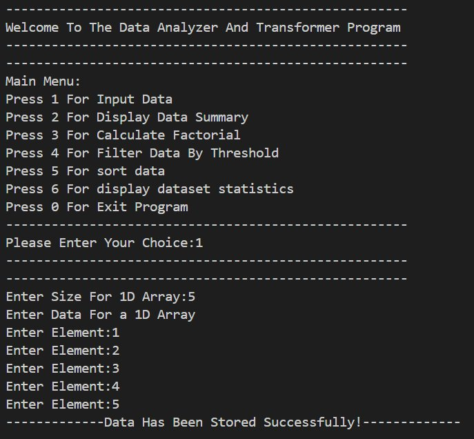
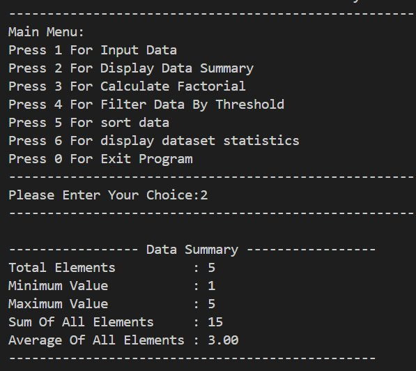
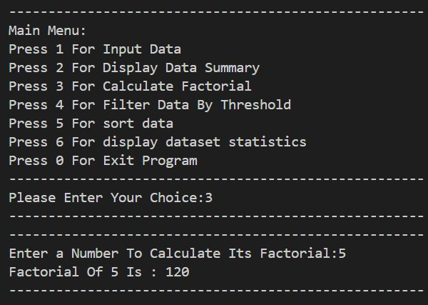
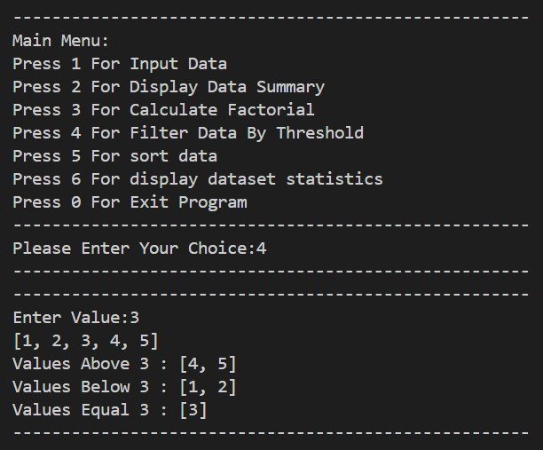
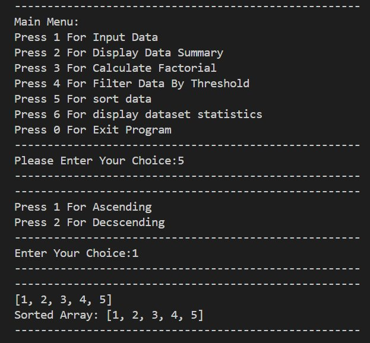
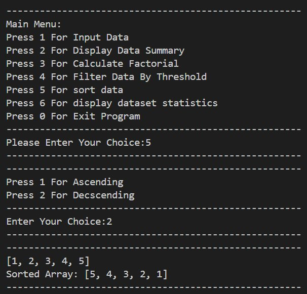
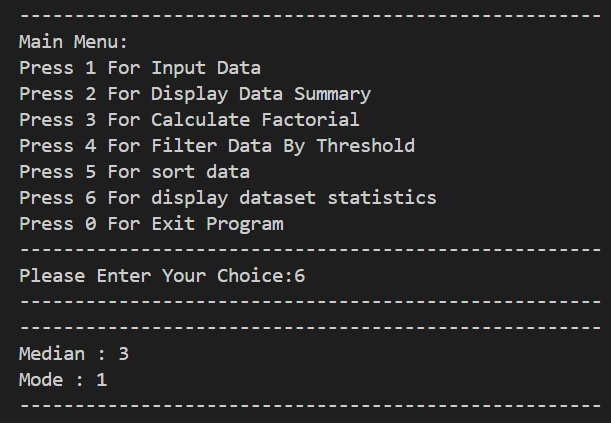
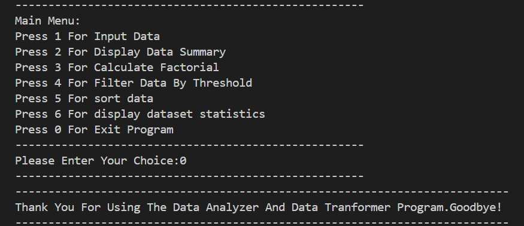

<div align="center">

# -- ! Data Analyzer And Transformer ! --
### *Interactive Console-Based Data Analysis & Transformation Program*

[](https://www.python.org/)
[](https://www.python.org/)
[](https://www.python.org/)
[](https://www.python.org/)

<br/>

> *"Data is the new oil — analyze it, transform it, and unlock its true power."*

</div>

---

## 📋 Table of Contents

- [📌 Overview](#-overview)
- [🎯 Problem Statement](#-problem-statement)
- [✨ Key Features](#-key-features)
- [🏗️ Project Structure](#️-project-structure)
- [🔄 Project Workflow](#-project-workflow)
- [📸 Program Output Screenshots](#-program-output-screenshots)
- [🔢 Feature Breakdown](#-feature-breakdown)
- [🛠️ Tech Stack](#️-tech-stack)
- [📈 Results & Insights](#-results--insights)
- [🏆 Advantages](#-advantages)
- [📄 License](#-license)
- [👤 Author](#-author)
- [🙏 Acknowledgements](#-acknowledgements)

---

## 📌 Overview

The **Data Analyzer And Transformer** is a beginner-friendly, interactive Python console application that demonstrates core programming concepts such as **arrays**, **sorting algorithms**, **factorial computation**, **statistical analysis**, and **threshold-based filtering**. The program presents a menu-driven interface that runs continuously until the user chooses to exit.

This project is designed to:
- Strengthen understanding of arrays, loops, and conditional logic
- Practice user input handling and menu-driven program design
- Apply mathematical and statistical logic to analyze datasets
- Demonstrate sorting, filtering, and summary operations on 1D arrays

---

## 🎯 Problem Statement

> **Objective:** Build a console-based interactive tool to input, analyze, sort, filter, and compute statistics on a dataset.

You are building a simple utility program for students learning Python. The program must accept user choices from a menu and execute the corresponding task — either storing data, displaying summaries, computing factorials, filtering by threshold, sorting arrays, or showing advanced statistics.

| 📂 Feature | 📄 Type | 🔍 Description |
|------------|---------|----------------|
| Input Data | Data Entry | Store elements into a 1D array |
| Data Summary | Analysis | Min, Max, Sum, Average of dataset |
| Factorial Calculator | Math | Compute factorial of any number |
| Filter By Threshold | Logic | Classify values above, below, equal to a threshold |
| Sort Data | Sorting | Arrange data in ascending or descending order |
| Dataset Statistics | Statistics | Compute Median and Mode of the dataset |
| Exit Program | Control | Gracefully exit the program |

The goal is to demonstrate **fundamental Python programming skills** through a clean, menu-driven interactive program.

---

## ✨ Key Features

| Feature | Description |
|--------|-------------|
| 🔁 **Infinite Menu Loop** | Program runs continuously until user selects Exit (Press 0) |
| 📥 **1D Array Input** | Dynamically store user-defined number of elements |
| 📊 **Data Summary** | Displays Total Elements, Min, Max, Sum, and Average |
| 🔢 **Factorial Calculator** | Computes factorial of any user-entered number |
| 🎯 **Threshold Filter** | Classifies data into Above, Below, and Equal groups |
| 🔃 **Dual Sorting** | Supports both Ascending and Descending sort |
| 📐 **Dataset Statistics** | Computes Median and Mode of stored data |
| ⚠️ **Invalid Input Handling** | Detects and reports invalid menu choices |

---

## 🏗️ Project Structure

```
📦 data-analyzer-transformer/
│
├── 📄 project.py          ← Main Python script (entry point)
│
└── 📄 README.md           ← Project documentation
```

---

## 🔄 Project Workflow

```
Program Start
      │
      ▼
┌─────────────────────────────────────────┐
│           Display Main Menu             │
│  1-Input | 2-Summary | 3-Factorial      │
│  4-Filter | 5-Sort | 6-Stats | 0-Exit   │
└────────────┬────────────────────────────┘
             │
     ┌───────┼────────┬──────────┬──────────┬──────────┐
     ▼       ▼        ▼          ▼          ▼          ▼
  [1]      [2]       [3]        [4]        [5]        [6]
Input    Summary  Factorial   Filter      Sort      Statistics
Data     Display  Compute    Threshold  Asc/Desc   Median/Mode
  │        │        │          │          │          │
  └────────┴────────┴──────────┴──────────┴──────────┘
                              │
                              ▼
                   Print Output to Console
                              │
                              ▼
                     Loop Back to Menu
                              │
                       (Choice: 0) Exit ✅
```

---

## 📸 Program Output Screenshots

### 🖥️ 1. Main Menu & Input Data (Choice: 1)

> User enters the size of the 1D array and inputs each element one by one. Data is stored successfully.



---

### 📊 2. Display Data Summary (Choice: 2)

> Displays a complete summary of the stored dataset — Total Elements, Minimum, Maximum, Sum, and Average.



---

### 🔢 3. Calculate Factorial (Choice: 3)

> User enters a number and the program computes and displays its factorial instantly.



---

### 🎯 4. Filter Data By Threshold (Choice: 4)

> User enters a threshold value. The program classifies all elements into three groups: Above, Below, and Equal to the threshold.



---

### 🔼 5. Sort Data — Ascending (Choice: 5 → 1)

> User chooses Ascending sort. The program displays the original array and the sorted result.



---

### 🔽 6. Sort Data — Descending (Choice: 5 → 2)

> User chooses Descending sort. The program displays the original array and the reverse-sorted result.



---

### 📐 7. Display Dataset Statistics (Choice: 6)

> Computes and displays the Median and Mode of the stored dataset.



---

### 🚪 8. Exit Program (Choice: 0)

> User selects Exit. The program displays a farewell message and terminates gracefully.



---

## 🔢 Feature Breakdown

### 📥 1. Input Data (Choice: 1)

> User specifies the size of the 1D array and enters each element.

**Logic:**
```python
size = int(input("Enter Size For 1D Array:"))
data = []
print("Enter Data For a 1D Array")
for i in range(size):
    element = int(input("Enter Element:"))
    data.append(element)
print("----------Data Has Been Stored Successfully!-----------")
```

**Sample Output:**
```
Enter Size For 1D Array:5
Enter Data For a 1D Array
Enter Element:1
Enter Element:2
Enter Element:3
Enter Element:4
Enter Element:5
----------Data Has Been Stored Successfully!-----------
```

---

### 📊 2. Display Data Summary (Choice: 2)

> Shows key statistics of the stored dataset.

**Logic:**
```python
print("Total Elements     :", len(data))
print("Minimum Value      :", min(data))
print("Maximum Value      :", max(data))
print("Sum Of All Elements:", sum(data))
print("Average Of All Elements:", round(sum(data)/len(data), 2))
```

**Sample Output (data = [1,2,3,4,5]):**
```
------------------ Data Summary ------------------
Total Elements     : 5
Minimum Value      : 1
Maximum Value      : 5
Sum Of All Elements: 15
Average Of All Elements : 3.00
```

---

### 🔢 3. Calculate Factorial (Choice: 3)

> Computes factorial using a loop.

**Logic:**
```python
n = int(input("Enter a Number To Calculate Its Factorial:"))
factorial = 1
for i in range(1, n + 1):
    factorial *= i
print(f"Factorial Of {n} Is : {factorial}")
```

**Sample Output:**
```
Enter a Number To Calculate Its Factorial:5
Factorial Of 5 Is : 120
```

---

### 🎯 4. Filter Data By Threshold (Choice: 4)

> Classifies elements relative to a threshold value.

**Logic:**
```python
threshold = int(input("Enter Value:"))
above = [x for x in data if x > threshold]
below = [x for x in data if x < threshold]
equal = [x for x in data if x == threshold]
print(f"Values Above {threshold} : {above}")
print(f"Values Below {threshold} : {below}")
print(f"Values Equal {threshold} : {equal}")
```

**Sample Output (threshold = 3):**
```
[1, 2, 3, 4, 5]
Values Above 3 : [4, 5]
Values Below 3 : [1, 2]
Values Equal 3 : [3]
```

---

### 🔃 5. Sort Data (Choice: 5)

> Sorts data in ascending or descending order based on user choice.

**Logic:**
```python
# Ascending
sorted_asc = sorted(data)
# Descending
sorted_desc = sorted(data, reverse=True)
```

**Sample Output:**
```
# Ascending (Choice 1):
[1, 2, 3, 4, 5]
Sorted Array: [1, 2, 3, 4, 5]

# Descending (Choice 2):
[1, 2, 3, 4, 5]
Sorted Array: [5, 4, 3, 2, 1]
```

---

### 📐 6. Dataset Statistics (Choice: 6)

> Computes Median and Mode of the stored dataset.

**Logic:**
```python
import statistics
print("Median :", statistics.median(data))
print("Mode   :", statistics.mode(data))
```

**Key Concepts Used:**

| Concept | Detail |
|---------|--------|
| 📊 `statistics.median()` | Middle value of sorted dataset |
| 📈 `statistics.mode()` | Most frequently occurring value |
| 🔁 `sorted()` | Built-in sort for ordering data |
| ➗ Modulus `%` | Even/Odd classification |
| ➕ Accumulator | Running total computation |

**Sample Output (data = [1,2,3,4,5]):**
```
Median : 3
Mode   : 1
```

---

## 🛠️ Tech Stack

| Tool | Version | Purpose |
|------|---------|---------|
| 🐍 **Python** | 3.8+ | Core programming language |
| 🔁 **While Loop** | Built-in | Infinite menu loop control |
| 🔂 **For Loop** | Built-in | Array traversal and element iteration |
| 📐 **statistics module** | Built-in | Median and Mode computation |
| 🧮 **Arithmetic Operators** | Built-in | Min, Max, Sum, Average, Factorial |
| 🖨️ **print() / input()** | Built-in | Console I/O and user interaction |
| 📋 **Lists (Arrays)** | Built-in | 1D data structure for storing elements |
| 📐 **f-strings** | Python 3.6+ | Formatted string output |

---

## 📈 Results & Insights

After running the program, the following outputs are produced:

- ✅ **Data Storage** — User-defined 1D arrays stored and managed dynamically
- 📊 **Complete Summary** — Min, Max, Sum, and Average computed accurately
- 🔢 **Factorial** — Correct factorial for any non-negative integer
- 🎯 **Threshold Filter** — Elements classified into Above, Below, and Equal groups
- 🔃 **Dual Sort** — Both ascending and descending order supported
- 📐 **Statistics** — Median and Mode computed using Python's statistics module
- 🔁 **Persistent Menu** — Program loops back after every task until manually exited
- ⚠️ **Error Feedback** — Invalid choices handled with appropriate messages

---

## 🏆 Advantages

| Advantage | Detail |
|-----------|--------|
| 🎓 **Beginner Friendly** | Core concepts: arrays, loops, conditionals, and I/O in one project |
| 🔄 **Reusability** | Each feature is modular and can be extracted into functions |
| 📚 **Educational** | Covers sorting, filtering, statistics — all in one program |
| 🖥️ **No External Dependencies** | Uses only Python built-ins and standard library |
| ⚡ **Lightweight** | Single-file script, instantly runnable from any terminal |
| 🧪 **Extensible** | Easy to add features like 2D arrays, charts, or file I/O |
| 📖 **Readable Code** | Clear `if-elif-else` structure makes logic easy to follow |
| 🛡️ **Input Safety** | Invalid menu and sub-menu choices are caught and reported |

---

## 📄 License

This project is licensed under the **MIT License** — see the [LICENSE](LICENSE) file for full details.

```
MIT License — Free to use, modify, and distribute with attribution.
```

---

## 👤 Author

<div align="center">

### KRINAL DHOLAKIYA

[](https://github.com/isamaliya16)
[](https://www.linkedin.com/in/ayush-isamaliya-686533312/)

> *"Every dataset tells a story — write the code that listens."*

**🎓 Role:** Junior Python Developer | Programming Enthusiast \
**📍 Location:** India\
**🛠️ Skills:** Python · Arrays · Data Analysis · CLI Applications · Logic Building

</div>

---

## 🙏 Acknowledgements

Special thanks to the following resources and communities that made this project possible:

- 📚 [Python Official Docs](https://docs.python.org/3/) — Official Python language reference
- 🔁 [Real Python — Lists](https://realpython.com/python-lists-tuples/) — In-depth list/array tutorials
- 📐 [GeeksForGeeks — Sorting](https://www.geeksforgeeks.org/sorting-algorithms/) — Sorting algorithm examples
- 🖥️ [W3Schools Python](https://www.w3schools.com/python/) — Beginner Python reference
- 🧮 [Python Statistics Module](https://docs.python.org/3/library/statistics.html) — Official statistics docs
- 💬 [Stack Overflow Community](https://stackoverflow.com/) — Problem-solving support
- 📖 [Kaggle Learn](https://www.kaggle.com/learn) — Python and programming courses

---

<div align="center">

---

*Made with ❤️ 
— Last updated: 05 June, 2026*

</div>
