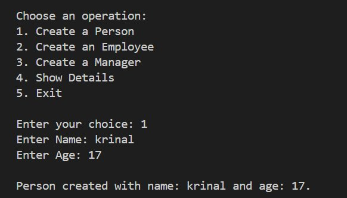
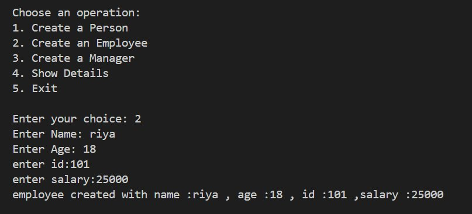
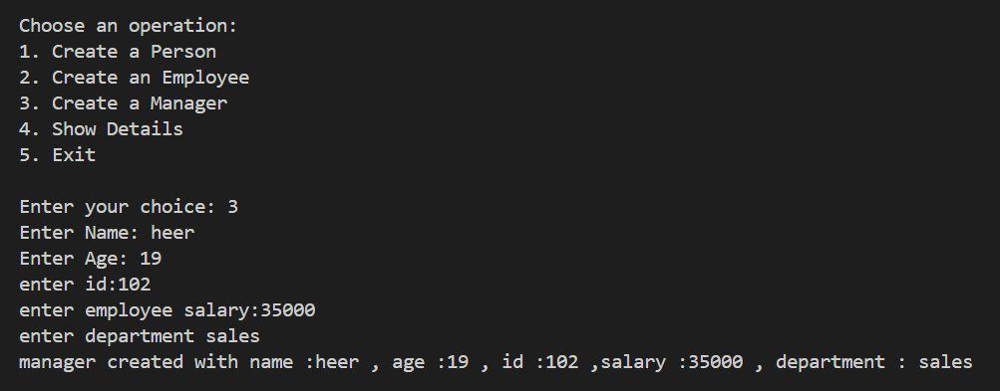
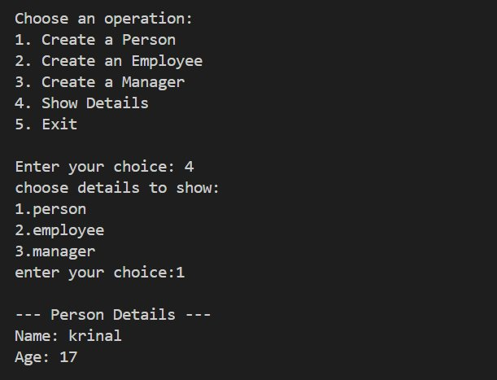
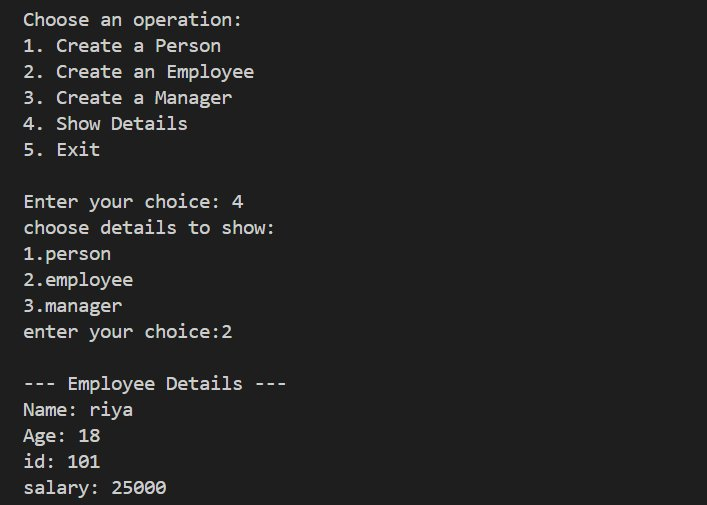
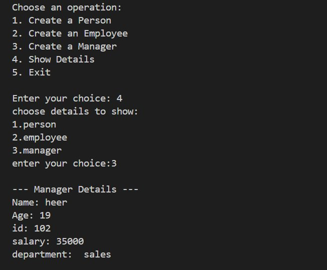
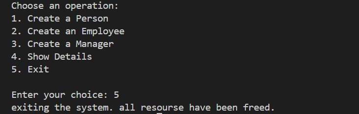

<div align="center">

# -- ! OOP Person, Employee & Manager System ! --
### *Interactive Console-Based Object-Oriented Programming in Python*

[](https://www.python.org/)
[](https://www.python.org/)
[](https://www.python.org/)
[](https://www.python.org/)

<br/>

> *"Object-Oriented Programming is not just a paradigm — it's how the real world thinks in code."*

</div>

---

## 📋 Table of Contents

- [📌 Overview](#-overview)
- [🎯 Problem Statement](#-problem-statement)
- [✨ Key Features](#-key-features)
- [🏗️ Project Structure](#️-project-structure)
- [🔄 Project Workflow](#-project-workflow)
- [👤 Part A — Class Design & OOP Logic](#-part-a--class-design--oop-logic)
- [🖥️ Part B — Program Outputs](#️-part-b--program-outputs)
- [🛠️ Tech Stack](#️-tech-stack)
- [📈 Results & Insights](#-results--insights)
- [🏆 Advantages](#-advantages)
- [📄 License](#-license)
- [👤 Author](#-author)
- [🙏 Acknowledgements](#-acknowledgements)

---

## 📌 Overview

The **OOP Person, Employee & Manager System** is a beginner-friendly, interactive Python console application that demonstrates core **Object-Oriented Programming (OOP)** concepts such as **class creation**, **single & multilevel inheritance**, **constructor chaining with `super()`**, and **method overriding**. The program presents a clean menu-driven interface that runs continuously until the user chooses to exit.

This project is designed to:
- Strengthen understanding of Python **classes and objects**
- Demonstrate **multilevel inheritance** — `Person` → `Employee` → `Manager`
- Practice **constructor design** using `__init__` and `super()`
- Apply **user input handling** and **menu-driven program design**
- Produce clean, readable **console output** for real-world-style object data

---

## 🎯 Problem Statement

> **Objective:** Build a console-based interactive tool to create and display Person, Employee, and Manager objects using OOP principles.

You are building a simple employee management utility for students learning Python. The program must accept user choices from a menu and execute the corresponding task — either creating an object of the selected class type or displaying its stored attributes.

| 📂 Class | 📄 Type | 🔍 Description |
|----------|---------|----------------|
| `Person` | Base Class | Stores `name` and `age` |
| `Employee` | Inherits `Person` | Adds `emp_id` and `salary` |
| `Manager` | Inherits `Employee` | Adds `department` information |
| Menu System | Console I/O | Create objects and display details via sub-menu |

The goal is to demonstrate **OOP hierarchy and real-world modeling** through a clean, interactive program.

---

## ✨ Key Features

| Feature | Description |
|--------|-------------|
| 🔁 **Infinite Menu Loop** | Program runs continuously until user selects Exit |
| 👤 **3 Class Types** | Person, Employee, and Manager using class inheritance |
| 🧬 **OOP Hierarchy** | `Person` → `Employee` → `Manager` (multilevel inheritance) |
| 🔗 **Constructor Chaining** | Uses `super().__init__()` to pass attributes up the chain |
| 📋 **Show Details** | Sub-menu displays full object data for any class type |
| 🖥️ **CLI Interface** | Simple, clean text-based menu for user interaction |
| ✅ **Input-Driven Flow** | Fully driven by user input with branching via `if-elif-else` |
| 🚪 **Graceful Exit** | Exit message confirms all resources have been freed |

---

## 🏗️ Project Structure

```
📦 oop-person-employee-manager/
│
├── 📄 project.py                   ← Main Python script (entry point)
├── 🖼️ output1_create_person.png    ← Output screenshot 1
├── 🖼️ output2_create_employee.png  ← Output screenshot 2
├── 🖼️ output3_create_manager.png   ← Output screenshot 3
├── 🖼️ output4_show_person.png      ← Output screenshot 4
├── 🖼️ output5_show_employee.png    ← Output screenshot 5
├── 🖼️ output6_show_manager.png     ← Output screenshot 6
├── 🖼️ output7_exit.png             ← Output screenshot 7
│
└── 📄 README.md                    ← Project documentation
```

---

## 🔄 Project Workflow

```
Program Start
      │
      ▼
┌──────────────────────────────┐
│      Display Main Menu       │  ← Options: Create / Show Details / Exit
└─────────────┬────────────────┘
              │
    ┌─────────┼──────────┬──────────┐
    ▼         ▼          ▼          ▼
┌────────┐ ┌────────┐ ┌────────┐ ┌────────┐
│Choice 1│ │Choice 2│ │Choice 3│ │Choice 4│
│ Person │ │Employee│ │Manager │ │  Show  │
└───┬────┘ └───┬────┘ └───┬────┘ └───┬────┘
    │          │           │          │
    ▼          ▼           ▼          ▼
 name,age  +id,salary  +department  Sub-menu
                                   1/2/3 →
                                  Show Details
    │          │           │          │
    └──────────┴───────────┴──────────┘
                      │
                      ▼
       ┌──────────────────────────┐
       │  Print Output to Console │
       └──────────────┬───────────┘
                      │
                      ▼
              Loop Back to Menu
                      │
               (Choice: 5) Exit ✅
```

---

## 👤 Part A — Class Design & OOP Logic

### 📝 1. What is OOP?

Object-Oriented Programming (OOP) is a programming paradigm that organizes code around **objects** — instances of **classes** that bundle data (attributes) and behavior (methods) together. It mirrors how the real world works: a `Manager` IS an `Employee` who IS a `Person`.

---

### 🗺️ 2. Class Hierarchy — Overview

| Class | Parent | New Attributes | Method |
|-------|--------|----------------|--------|
| `Person` | — | `name`, `age` | `show()` |
| `Employee` | `Person` | `emp_id`, `salary` | `show()` overrides |
| `Manager` | `Employee` | `department` | `show()` overrides |

---

### 👤 3. Person — Base Class

> The root class that stores the most basic human attributes: name and age.

**Logic:**
```python
class Person:
    def __init__(self, name, age):
        self.name = name
        self.age = age

    def show(self):
        print("--- Person Details ---")
        print(f"Name: {self.name}")
        print(f"Age: {self.age}")
```

---

### 💼 4. Employee — Inherits from Person

> Extends `Person` by adding an employee ID and salary using `super()`.

**Logic:**
```python
class Employee(Person):
    def __init__(self, name, age, emp_id, salary):
        super().__init__(name, age)
        self.emp_id = emp_id
        self.salary = salary

    def show(self):
        print("--- Employee Details ---")
        print(f"Name: {self.name}")
        print(f"Age: {self.age}")
        print(f"id: {self.emp_id}")
        print(f"salary: {self.salary}")
```

---

### 🏢 5. Manager — Inherits from Employee

> Extends `Employee` with a department field, completing a 3-level inheritance chain.

**Logic:**
```python
class Manager(Employee):
    def __init__(self, name, age, emp_id, salary, department):
        super().__init__(name, age, emp_id, salary)
        self.department = department

    def show(self):
        print("--- Manager Details ---")
        print(f"Name: {self.name}")
        print(f"Age: {self.age}")
        print(f"id: {self.emp_id}")
        print(f"salary: {self.salary}")
        print(f"department: {self.department}")
```

---

### 🔬 6. Key OOP Concepts Used

| Concept | Detail |
|---------|--------|
| 🧬 **Inheritance** | `Employee` extends `Person`; `Manager` extends `Employee` |
| 🔧 **`__init__` Constructor** | Each class initializes its own unique attributes |
| 🔗 **`super()`** | Child classes call parent constructors to chain initialization |
| 🔁 **Method Overriding** | `show()` is redefined in each class for custom output |
| 🔒 **Encapsulation** | Each class manages and protects its own data fields |
| 🏗️ **Multilevel Inheritance** | 3-tier chain: Person → Employee → Manager |

---

## 🖥️ Part B — Program Outputs

### ▶️ Output 1 — Create a Person

> User selects option `1`, enters **name** and **age** to create a `Person` object.



---

### ▶️ Output 2 — Create an Employee

> User selects option `2`, enters **name**, **age**, **employee ID**, and **salary** to create an `Employee` object.



---

### ▶️ Output 3 — Create a Manager

> User selects option `3`, enters **name**, **age**, **ID**, **salary**, and **department** name to create a `Manager` object.



---

### ▶️ Output 4 — Show Person Details

> User selects option `4 → 1` to display stored **Person Details** — Name and Age.



---

### ▶️ Output 5 — Show Employee Details

> User selects option `4 → 2` to display stored **Employee Details** — Name, Age, ID, and Salary.



---

### ▶️ Output 6 — Show Manager Details

> User selects option `4 → 3` to display full **Manager Details** including Department.



---

### ▶️ Output 7 — Exit the Program

> User selects option `5` to gracefully exit. System confirms: *"exiting the system. all resourse have been freed."*



---

## 🛠️ Tech Stack

| Tool | Version | Purpose |
|------|---------|---------|
| 🐍 **Python** | 3.8+ | Core programming language |
| 🏗️ **Classes & Objects** | Built-in | Define Person, Employee, Manager blueprints |
| 🧬 **Inheritance** | OOP Concept | Share and extend class attributes across levels |
| 🔗 **`super()`** | Built-in | Chain constructors up the inheritance hierarchy |
| 🔁 **While Loop** | Built-in | Infinite menu loop control |
| 🔀 **if-elif-else** | Built-in | Branch menu choices and sub-menu choices |
| 🖨️ **print() / input()** | Built-in | Console I/O and user interaction |
| 📐 **f-strings** | Python 3.6+ | Formatted string output for object details |

---

## 📈 Results & Insights

After running the program, the following outputs are produced:

- ✅ **3 Object Types Created** — Person, Employee, and Manager with full attribute sets
- 🧬 **Inheritance Chain Works** — Manager successfully inherits from Employee which inherits from Person
- 🔗 **`super()` Chaining** — Attributes passed correctly up the 3-level constructor chain
- 📋 **Show Details Sub-Menu** — All stored object attributes displayed cleanly by type
- 🔁 **Persistent Menu** — Program loops back after every task until manually exited
- 🚪 **Graceful Exit** — Option 5 displays proper confirmation message on shutdown

---

## 🏆 Advantages

| Advantage | Detail |
|-----------|--------|
| 🎓 **Beginner Friendly** | Core OOP concepts: classes, inheritance, constructors in one project |
| 🔄 **Reusability** | Classes can be reused and extended in larger real-world systems |
| 📚 **Educational** | Each class reinforces `__init__`, `super()`, and method overriding |
| 🖥️ **No Dependencies** | Runs with pure Python — no external libraries needed |
| ⚡ **Lightweight** | Single-file script, instantly runnable from any terminal |
| 🧪 **Extensible** | Easy to add new classes like `Director`, `Intern`, `Contractor`, etc. |
| 📖 **Readable Code** | Clear class hierarchy and `if-elif-else` makes logic easy to follow |
| 🛡️ **Modular Design** | Each class is self-contained and independently testable |

---

## 📄 License

This project is licensed under the **MIT License** — see the [LICENSE](LICENSE) file for full details.

```
MIT License — Free to use, modify, and distribute with attribution.
```

---

## 👤 Author

<div align="center">

### Ayush Isamaliya

[](https://github.com/isamaliya16)
[](https://www.linkedin.com/in/ayush-isamaliya-686533312/)

> *"Every class is a blueprint — every object is a story waiting to be told."*

**🎓 Role:** Junior Python Developer | OOP Enthusiast \
**📍 Location:** India\
**🛠️ Skills:** Python · OOP · Classes · Inheritance · CLI Applications · Logic Building

</div>

---

## 🙏 Acknowledgements

Special thanks to the following resources and communities that made this project possible:

- 📚 [Python Official Docs](https://docs.python.org/3/) — Official Python language reference
- 🧬 [Real Python — OOP](https://realpython.com/python3-object-oriented-programming/) — In-depth OOP tutorials
- 🔗 [Real Python — super()](https://realpython.com/python-super/) — Constructor chaining with super()
- 📐 [GeeksForGeeks — Classes](https://www.geeksforgeeks.org/python-classes-and-objects/) — Class and inheritance examples
- 🖥️ [W3Schools Python](https://www.w3schools.com/python/) — Beginner Python reference
- 💬 [Stack Overflow Community](https://stackoverflow.com/) — Problem-solving support
- 📖 [Kaggle Learn](https://www.kaggle.com/learn) — Python and programming courses

---

<div align="center">

---

*Made with ❤️ and ☕ — Last updated: 11 June, 2026*

</div>
