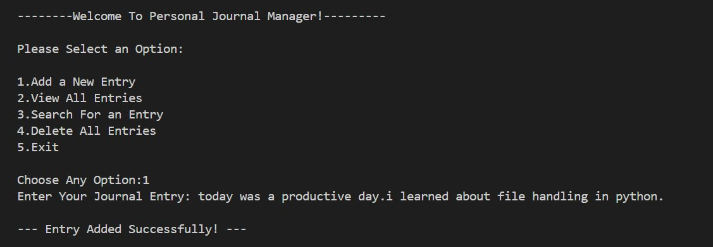
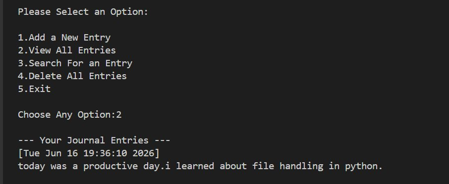
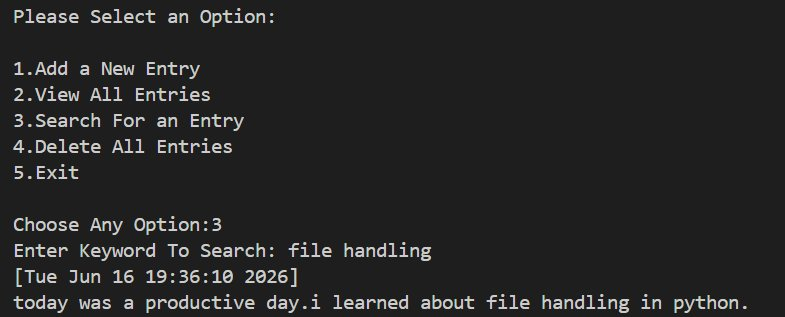
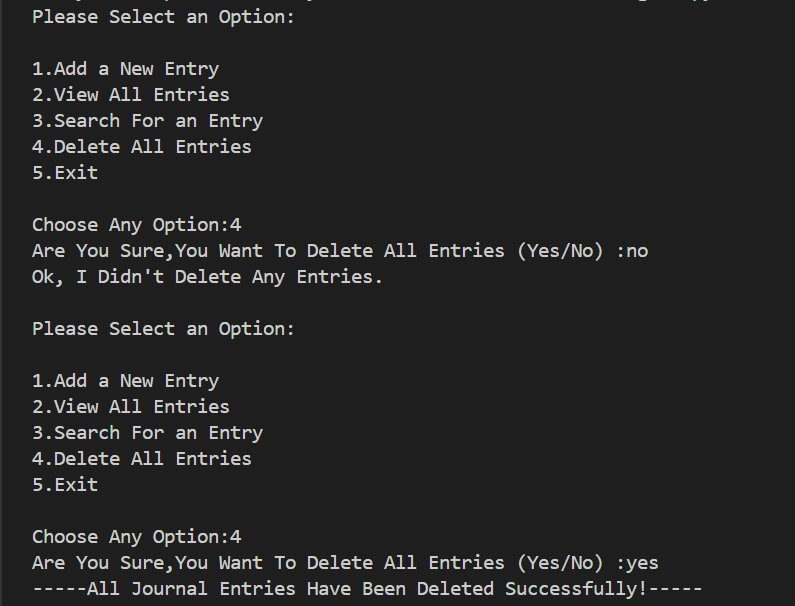
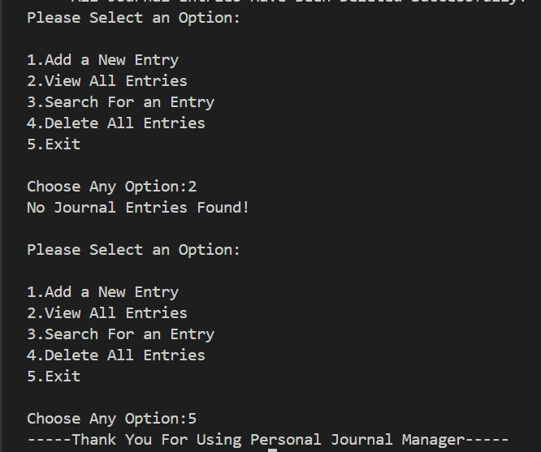

<div align="center">

# 📔 -- ! Personal Journal Manager ! --
### *Interactive Console-Based Journal with File Handling in Python*

[](https://www.python.org/)
[](https://www.python.org/)
[](https://www.python.org/)
[](https://www.python.org/)

<br/>

> *"A journal is a mirror of your thoughts — Python makes it permanent."*

</div>

---

## 📋 Table of Contents

- [📌 Overview](#-overview)
- [🎯 Problem Statement](#-problem-statement)
- [✨ Key Features](#-key-features)
- [🏗️ Project Structure](#️-project-structure)
- [🔄 Project Workflow](#-project-workflow)
- [🖥️ Program Menu](#️-program-menu)
- [📸 Output Screenshots](#-output-screenshots)
- [🛠️ Tech Stack](#️-tech-stack)
- [📈 Results & Insights](#-results--insights)
- [🏆 Advantages](#-advantages)
- [📄 License](#-license)
- [👤 Author](#-author)
- [🙏 Acknowledgements](#-acknowledgements)

---

## 📌 Overview

The **Personal Journal Manager** is a beginner-friendly, interactive Python console application that demonstrates core file handling concepts such as **reading/writing files**, **timestamp logging**, **keyword-based search**, and **safe deletion** with confirmation. The program presents a menu-driven interface that runs continuously until the user chooses to exit.

This project is designed to:
- Strengthen understanding of **file I/O** in Python (`open`, `read`, `write`, `append`)
- Practice user input validation and menu-driven program design
- Apply `datetime` module for automatic timestamping of entries
- Build a real-world utility: a **personal diary application**

---

## 🎯 Problem Statement

> **Objective:** Build a console-based interactive journal manager that stores, retrieves, searches, and deletes personal diary entries using file handling.

You are building a simple journal utility program for everyday users. The program must accept user choices from a menu and execute the corresponding task — adding entries with timestamps, viewing all past entries, searching by keyword, or deleting all records.

| 📂 Feature | 📄 Type | 🔍 Description |
|------------|---------|----------------|
| Add Entry | File Write | Appends journal text with a timestamp to a `.txt` file |
| View All Entries | File Read | Reads and displays all stored journal entries |
| Search Entry | Keyword Search | Finds entries matching a user-given keyword |
| Delete All Entries | File Clear | Wipes all entries after user confirmation |
| Exit | Loop Control | Gracefully exits the program |

The goal is to demonstrate **Python file handling skills** through a clean, practical, and menu-driven interactive journal program.

---

## ✨ Key Features

| Feature | Description |
|--------|-------------|
| 🔁 **Infinite Menu Loop** | Program runs continuously until user selects Exit |
| ✍️ **Add Journal Entry** | Saves text input with a real-time timestamp |
| 📖 **View All Entries** | Reads and prints every stored journal entry |
| 🔍 **Keyword Search** | Searches all entries for a matching keyword |
| 🗑️ **Delete All Entries** | Safely clears journal after Yes/No confirmation |
| 🕐 **Auto Timestamp** | Each entry tagged with date and time automatically |
| 🖥️ **CLI Interface** | Simple, clean text-based menu for user interaction |
| ⚠️ **Confirmation Guard** | Delete requires explicit `yes` confirmation |

---

## 🏗️ Project Structure

```
📦 personal-journal-manager/
│
├── 📄 journal.py          ← Main Python script (entry point)
├── 📄 journal.txt         ← Auto-created file storing all entries
│
└── 📄 README.md           ← Project documentation
```

---

## 🔄 Project Workflow

```
Program Start
      │
      ▼
┌─────────────────────────────┐
│   Display Main Menu         │  ← Options: Add / View / Search / Delete / Exit
└────────────┬────────────────┘
             │
     ┌───────┼────────┬────────────┐
     ▼       ▼        ▼            ▼
┌─────────┐ ┌──────┐ ┌──────────┐ ┌──────────┐
│Choice: 1│ │ Ch:2 │ │  Ch: 3   │ │  Ch: 4   │
│Add Entry│ │ View │ │  Search  │ │  Delete  │
└────┬────┘ └──┬───┘ └────┬─────┘ └────┬─────┘
     │         │           │             │
     ▼         ▼           ▼             ▼
┌─────────┐ ┌──────┐ ┌──────────┐ ┌──────────┐
│Input    │ │Read  │ │ Input    │ │Confirm   │
│Text →   │ │File  │ │ Keyword  │ │Yes/No    │
│Append   │ │Print │ │ → Match  │ │→ Clear   │
│w/Time   │ │All   │ │  Found   │ │  File    │
└────┬────┘ └──┬───┘ └────┬─────┘ └────┬─────┘
     │         │           │             │
     └─────────┴───────────┴─────────────┘
                           │
                  Loop Back to Menu
                           │
                    (Choice: 5) Exit ✅
```

---

## 🖥️ Program Menu

```
--------Welcome To Personal Journal Manager!---------

Please Select an Option:

1.Add a New Entry
2.View All Entries
3.Search For an Entry
4.Delete All Entries
5.Exit

Choose Any Option:
```

---

## 📸 Output Screenshots

### ✍️ 1. Adding a New Journal Entry

> User selects option `1`, types their journal entry, and it gets saved with a timestamp.



---

### 📖 2. Viewing All Journal Entries

> User selects option `2` to display all stored entries with their timestamps.



---

### 🔍 3. Searching For an Entry

> User selects option `3`, enters a keyword like `"file handling"`, and matching entries are displayed.



---

### 🗑️ 4. Deleting All Entries (With Confirmation)

> User selects option `4`. First denied with `no`, then confirmed with `yes` to delete all entries.



---

### 🚪 5. Empty Journal & Exit

> After deletion, viewing shows `"No Journal Entries Found!"`. Option `5` exits the program gracefully.



---

## 🔢 Core Logic — Code Snippets

### 📝 1. Add a New Entry (Append with Timestamp)

```python
import datetime

def add_entry():
    entry = input("Enter Your Journal Entry: ")
    timestamp = datetime.datetime.now().ctime()
    with open("journal.txt", "a") as file:
        file.write(f"[{timestamp}]\n{entry}\n\n")
    print("\n--- Entry Added Successfully! ---\n")
```

---

### 📖 2. View All Entries (Read File)

```python
def view_entries():
    try:
        with open("journal.txt", "r") as file:
            content = file.read()
            if content.strip():
                print("\n--- Your Journal Entries ---")
                print(content)
            else:
                print("No Journal Entries Found!")
    except FileNotFoundError:
        print("No Journal Entries Found!")
```

---

### 🔍 3. Search For an Entry (Keyword Match)

```python
def search_entry():
    keyword = input("Enter Keyword To Search: ")
    try:
        with open("journal.txt", "r") as file:
            entries = file.read().split("\n\n")
            found = [e for e in entries if keyword.lower() in e.lower()]
            if found:
                for entry in found:
                    print(entry)
            else:
                print("No Matching Entries Found!")
    except FileNotFoundError:
        print("No Journal Entries Found!")
```

---

### 🗑️ 4. Delete All Entries (With Confirmation)

```python
def delete_entries():
    confirm = input("Are You Sure,You Want To Delete All Entries (Yes/No) :")
    if confirm.lower() == "yes":
        with open("journal.txt", "w") as file:
            file.write("")
        print("-----All Journal Entries Have Been Deleted Successfully!-----\n")
    else:
        print("Ok, I Didn't Delete Any Entries.\n")
```

---

## 🛠️ Tech Stack

| Tool | Version | Purpose |
|------|---------|---------|
| 🐍 **Python** | 3.8+ | Core programming language |
| 📁 **File I/O** | Built-in | `open()`, `read()`, `write()`, `append` mode |
| 🕐 **datetime** | Built-in | Auto-generate entry timestamps |
| 🔁 **While Loop** | Built-in | Infinite menu loop control |
| 🖨️ **print() / input()** | Built-in | Console I/O and user interaction |
| 📐 **f-strings** | Python 3.6+ | Formatted string output |

---

## 📈 Results & Insights

After running the program, the following outputs are produced:

- ✅ **Entry Added** — Journal entry saved with live timestamp to `journal.txt`
- 📖 **All Entries Viewed** — Complete history read from file and printed to console
- 🔍 **Keyword Search** — Matching entries found and displayed accurately
- 🗑️ **Safe Deletion** — Entries deleted only after explicit `yes` confirmation
- ❌ **No Entries Handled** — `"No Journal Entries Found!"` shown when file is empty
- 🔁 **Persistent Menu** — Program loops back after every task until manually exited

---

## 🏆 Advantages

| Advantage | Detail |
|-----------|--------|
| 🎓 **Beginner Friendly** | Covers file I/O, loops, conditionals, and datetime in one project |
| 💾 **Persistent Storage** | Entries saved to disk — data survives program restarts |
| 🔄 **Reusability** | Functions can be extended for categories, tags, or passwords |
| 📚 **Educational** | Real-world use case to learn file handling practically |
| 🖥️ **No Dependencies** | Runs with pure Python — no external libraries needed |
| ⚡ **Lightweight** | Single-file script, instantly runnable from any terminal |
| 🧪 **Extensible** | Easy to add edit, password lock, or export-to-PDF features |
| 🛡️ **Input Safety** | Delete is guarded by Yes/No confirmation to prevent accidents |

---

## 📄 License

This project is licensed under the **MIT License** — see the [LICENSE](LICENSE) file for full details.

```
MIT License — Free to use, modify, and distribute with attribution.
```

---

## 👤 Author

<div align="center">

### Ayush Isamaliya

[](https://github.com/isamaliya16)
[](https://www.linkedin.com/in/ayush-isamaliya-686533312/)

> *"Every journal entry is a step toward understanding yourself — Python makes sure it's never forgotten."*

**🎓 Role:** Junior Python Developer | Programming Enthusiast \
**📍 Location:** India\
**🛠️ Skills:** Python · File Handling · CLI Applications · Logic Building · Datetime

</div>

---

## 🙏 Acknowledgements

Special thanks to the following resources and communities that made this project possible:

- 📚 [Python Official Docs](https://docs.python.org/3/) — Official Python language reference
- 📁 [Real Python — File I/O](https://realpython.com/read-write-files-python/) — In-depth file handling tutorials
- 🕐 [Python datetime Docs](https://docs.python.org/3/library/datetime.html) — Datetime module reference
- 🖥️ [W3Schools Python](https://www.w3schools.com/python/) — Beginner Python reference
- 📐 [Python f-strings Guide](https://realpython.com/python-f-strings/) — Formatted string literals
- 💬 [Stack Overflow Community](https://stackoverflow.com/) — Problem-solving support
- 📖 [GeeksForGeeks — File Handling](https://www.geeksforgeeks.org/file-handling-python/) — File handling examples

---

<div align="center">

---

*Made with ❤️ and ☕ — Last updated: 16 June, 2026*

</div>
