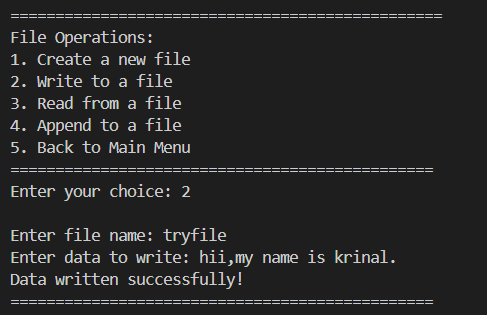
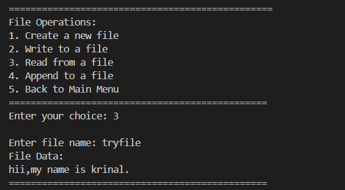
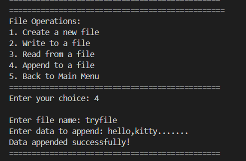

<div align="center">

# -- ! Multi-Utility Toolkit ! --
### *Interactive Console-Based Date, Math, Random Data, UUID & File Operations Hub*

[](https://www.python.org/)
[](https://www.python.org/)
[](https://www.python.org/)
[](https://www.python.org/)

<br/>

> *"One menu, many tools — a Swiss-army knife written entirely in Python."*

</div>

---

## 📋 Table of Contents

- [📌 Overview](#-overview)
- [🎯 Problem Statement](#-problem-statement)
- [✨ Key Features](#-key-features)
- [🏗️ Project Structure](#️-project-structure)
- [🔄 Project Workflow](#-project-workflow)
- [🕐 Module 1 — Datetime & Time Operations](#-module-1--datetime--time-operations)
- [🧮 Module 2 — Mathematical Operations](#-module-2--mathematical-operations)
- [🎲 Module 3 — Random Data Generation](#-module-3--random-data-generation)
- [🆔 Module 4 — Generate Unique Identifiers](#-module-4--generate-unique-identifiers)
- [📁 Module 5 — File Operations](#-module-5--file-operations)
- [🔍 Module 6 — Explore Module Attributes](#-module-6--explore-module-attributes)
- [🚪 Exit](#-exit)
- [🛠️ Tech Stack](#️-tech-stack)
- [📈 Results & Insights](#-results--insights)
- [🏆 Advantages](#-advantages)
- [📄 License](#-license)
- [👤 Author](#-author)
- [🙏 Acknowledgements](#-acknowledgements)

---

## 📌 Overview

The **Multi-Utility Toolkit** is an interactive, menu-driven Python console application that bundles together six independent mini-tools into a single program. It demonstrates **nested `while`/`match-case` menus**, **structural pattern matching**, **exception handling**, and practical use of Python's standard library (`datetime`, `time`, `math`, `random`, `uuid`, and file I/O).

This project is designed to:
- Strengthen understanding of nested menu loops built with `while True` + `match-case`
- Practice real-world use of standard library modules instead of toy examples
- Apply input validation and exception handling (`try/except`) around user input
- Provide a single, reusable CLI hub for everyday small utility tasks

---

## 🎯 Problem Statement

> **Objective:** Build a single console-based utility hub that consolidates date/time tools, math tools, random data generators, identifier generation, and basic file handling — all behind one clean menu.

You are building a personal productivity CLI that a developer could keep open in a terminal tab. Instead of writing six separate scripts, the program routes the user through a main menu into focused sub-menus, executes the selected operation, and always loops back until the user explicitly exits.

| 📂 Module | 📄 Type | 🔍 Description |
|------------|---------|----------------|
| Datetime & Time Operations | Sub-Menu | Current time, date diff, custom formatting, stopwatch, countdown |
| Mathematical Operations | Sub-Menu | Factorial, compound interest, trigonometry, geometric areas |
| Random Data Generation | Sub-Menu | Random number, random list, password generator, OTP generator |
| Generate Unique Identifiers | Direct Action | Generates a UUID4 identifier |
| File Operations | Sub-Menu | Create, write, read, and append text files |
| Explore Module Attributes | Direct Action | Lists `dir()` attributes of a chosen standard library module |

The goal is to demonstrate **practical standard-library Python skills** through a clean, layered, menu-driven interactive program.

---

## ✨ Key Features

| Feature | Description |
|--------|-------------|
| 🔁 **Infinite Main Menu Loop** | Program runs continuously until user selects Exit (Option 7) |
| 🧩 **Layered Sub-Menus** | Each module (Datetime, Math, Random, File) opens its own nested loop menu |
| 🔀 **`match-case` Routing** | Both main menu and sub-menus are routed using Python's structural pattern matching |
| 🕐 **5 Date/Time Tools** | Current time, date difference, custom formatting, stopwatch, countdown timer |
| 🧮 **4 Math Tools** | Factorial, compound interest, trigonometric values, geometric areas |
| 🎲 **4 Random Tools** | Random number, random list, password generator, OTP generator |
| 🆔 **UUID Generator** | Instantly generates a version-4 UUID |
| 📁 **4 File Tools** | Create, write, read, and append operations on text files |
| 🔍 **Module Explorer** | Inspects and prints `dir()` output for `math`, `time`, `random`, `datetime`, `uuid` |
| ⚠️ **Robust Input Handling** | `try/except ValueError` guards on the main menu; `FileExistsError` / `FileNotFoundError` guards on file tools |

---

## 🏗️ Project Structure

```
📦 multi-utility-toolkit/
│
├── 📄 toolkit.py             ← Main Python script (entry point)
│
├── 📁 screenshots/           ← All console output screenshots
│   ├── 01_current_datetime.png
│   ├── 02_format_date.png
│   ├── 03_countdown_timer.png
│   ├── 04_compound_interest.png
│   ├── 05_trigonometric.png
│   ├── 06_area_shapes.png
│   ├── 07_random_list.png
│   ├── 08_random_password.png
│   ├── 09_random_otp.png
│   ├── 10_generate_uuid.png
│   ├── 11_create_file.png
│   ├── 12_write_file.png
│   ├── 13_read_file.png
│   ├── 14_append_file.png
│   ├── 15_explore_module.png
│   └── 16_exit_program.png
│
└── 📄 README.md              ← Project documentation
```

---

## 🔄 Project Workflow

```
Program Start
      │
      ▼
┌─────────────────────────────────┐
│        Display Main Menu        │  ← Options 1-7
└────────────────┬─────────────────┘
                 │
  ┌──────┬──────┬──────┬──────┬──────┬──────┐
  ▼      ▼      ▼      ▼      ▼      ▼      ▼
 [1]    [2]    [3]    [4]    [5]    [6]    [7]
Date   Math  Random  UUID   File  Module  Exit
Time   Ops    Data           Ops  Explore  ✅
  │      │      │      │      │      │
  ▼      ▼      ▼      ▼      ▼      ▼
Nested Nested Nested Direct Nested Direct
Sub-   Sub-   Sub-   Print  Sub-   Print
Menu   Menu   Menu          Menu
  │      │      │      │      │      │
  └──────┴──────┴──────┴──────┴──────┘
                 │
                 ▼
       Print Output to Console
                 │
                 ▼
        Loop Back to Main Menu
```

---

## 🕐 Module 1 — Datetime & Time Operations

> Five tools covering everything from "what time is it" to a working stopwatch and countdown timer.

**Logic (sub-menu routing):**
```python
match choice2:
    case 1:
        print(f"Current Date and Time: {datetime.datetime.now()}")
    case 2:
        d1 = datetime.datetime.strptime(date1, "%d-%m-%Y")
        d2 = datetime.datetime.strptime(date2, "%d-%m-%Y")
        dif = d2 - d1
    case 3:
        d = datetime.datetime.strptime(for_date, "%d-%m-%Y")
        # reformatted with strftime based on A/B/C choice
    case 4:
        start_time = time.time()
        # ...
        elapsed_time = timedelta(seconds=int(end_time - start_time))
    case 5:
        while seconds > 0:
            print(f"Time Remaining: {seconds} seconds", end="\r")
            time.sleep(1)
            seconds -= 1
```

**📸 Current Date & Time**


**📸 Format Date Into Custom Format**


**📸 Countdown Timer**


---

## 🧮 Module 2 — Mathematical Operations

> Four calculators built on the `math` module — factorial, compound interest, trigonometry, and area formulas.

**Logic:**
```python
case 1:  # Factorial
    fact = math.factorial(n)
case 2:  # Compound Interest
    amount = p * ((1 + r / 100) ** t)
case 3:  # Trigonometric Calculations
    rad = math.radians(angle)
    sin_val, cos_val = math.sin(rad), math.cos(rad)
case 4:  # Area of Geometric Shapes
    area = math.pi * r * r        # Circle
    area = l * w                  # Rectangle
    area = s * s                  # Square
```

**📸 Compound Interest**


**📸 Trigonometric Calculations**


**📸 Area of Geometric Shapes**


---

## 🎲 Module 3 — Random Data Generation

> Four generators built on the `random` module — single numbers, lists, passwords, and OTPs.

**Logic:**
```python
case 1:  # Random Number
    random_num = random.randint(start, end)
case 2:  # Random List
    random_list = [random.randint(start, end) for _ in range(length)]
case 3:  # Random Password
    password = "".join(random.choice(chars) for _ in range(length))
case 4:  # Random OTP
    otp = "".join(random.choice(digits) for _ in range(length))
```

**📸 Generate Random List**


**📸 Create Random Password**


**📸 Generate Random OTP**


---

## 🆔 Module 4 — Generate Unique Identifiers

> A single direct action that produces a version-4 UUID using Python's `uuid` module.

**Logic:**
```python
case 4:
    unique_id = uuid.uuid4()
    print(f"Generated UUID: {unique_id}")
```

**📸 Generate UUID**


---

## 📁 Module 5 — File Operations

> Four foundational file-handling tools — create, write, read, and append — wrapped with proper exception handling.

**Logic:**
```python
case 1:  # Create
    with open(filename, "x") as file:
        pass
case 2:  # Write
    with open(filename, "w") as file:
        file.write(data)
case 3:  # Read
    with open(filename, "r") as file:
        data = file.read()
case 4:  # Append
    with open(filename, "a") as file:
        file.write("\n" + data)
```

**📸 Create a New File**


**📸 Write to a File**



**📸 Read from a File**



**📸 Append to a File**



---

## 🔍 Module 6 — Explore Module Attributes

> Inspects the attributes of any of the five standard library modules used in this project via Python's built-in `dir()`.

**Logic:**
```python
if dir_choice == 1:
    print(dir(math))
elif dir_choice == 2:
    print(dir(time))
elif dir_choice == 3:
    print(dir(random))
elif dir_choice == 4:
    print(dir(datetime))
elif dir_choice == 5:
    print(dir(uuid))
```

**📸 Explore `random` Module Attributes**


---

## 🚪 Exit

> Option 7 breaks the outer `while True` loop and gracefully ends the program.

**Logic:**
```python
case 7:
    print("Thank You For Using The Multi-Utility Toolkit!")
    break
```

**📸 Exit Screen**


---

## 🛠️ Tech Stack

| Tool | Version | Purpose |
|------|---------|---------|
| 🐍 **Python** | 3.10+ | Core language (required for `match-case`) |
| 🔁 **While Loop** | Built-in | Main menu and every sub-menu loop control |
| 🔀 **match-case** | Built-in | Structural pattern matching for menu routing |
| 📅 **datetime** | Built-in | Current time, date diff, custom date formatting |
| ⏱️ **time** | Built-in | Stopwatch and countdown timer |
| 🧮 **math** | Built-in | Factorial, trigonometry, geometry, constants |
| 🎲 **random** | Built-in | Random numbers, lists, passwords, OTPs |
| 🆔 **uuid** | Built-in | UUID4 generation |
| 📁 **File I/O** | Built-in | Create / write / read / append text files |
| 🖨️ **f-strings** | Python 3.6+ | Formatted console output |

---

## 📈 Results & Insights

After running the program, the following outputs are produced:

- ✅ **6 Independent Modules** — Datetime, Math, Random Data, UUID, File Ops, Module Explorer
- 🕐 **5 Date/Time Tools Verified** — current time, date diff, formatting, stopwatch, countdown
- 🧮 **4 Math Tools Verified** — factorial, compound interest, trigonometry, geometric area
- 🎲 **4 Random Tools Verified** — number, list, password, OTP, all using secure-feeling randomness
- 📁 **Full File Lifecycle Verified** — create → write → read → append, all on the same file
- 🔁 **Persistent Main Menu** — program loops back after every task until Option 7 is chosen
- ⚠️ **Error Feedback** — invalid menu input and file errors are caught and reported cleanly

---

## 🏆 Advantages

| Advantage | Detail |
|-----------|--------|
| 🧰 **All-in-One Utility** | Replaces 6 small scripts with one cohesive CLI |
| 🔀 **Modern Routing** | Uses `match-case` instead of long `if-elif` chains |
| 📚 **Educational** | Touches `datetime`, `time`, `math`, `random`, `uuid`, and file I/O in one place |
| 🖥️ **No Dependencies** | Runs with pure Python — no external libraries needed |
| ⚡ **Lightweight** | Single-file script, instantly runnable from any terminal |
| 🧪 **Extensible** | Easy to add new sub-menu options (e.g., unit converter, BMI calculator) |
| 🛡️ **Input Safety** | `try/except` guards around menu input and file operations |
| 🔍 **Self-Documenting** | Built-in module explorer doubles as a quick reference tool |

---

## 📄 License

This project is licensed under the **MIT License** — see the [LICENSE](LICENSE) file for full details.

```
MIT License — Free to use, modify, and distribute with attribution.
```

---

## 👤 Author

<div align="center">

### Your Name

[](https://github.com/yourhandle)
[](https://www.linkedin.com/in/yourhandle/)

> *"A good toolkit doesn't do one thing well — it does many things just well enough."*

**🎓 Role:** Python Developer | Programming Enthusiast \
**📍 Location:** India \
**🛠️ Skills:** Python · Standard Library · CLI Applications · Logic Building · match-case

</div>

> ✏️ **Note:** Replace `Your Name`, the GitHub handle, and LinkedIn link above with your own details before publishing.

---

## 🙏 Acknowledgements

Special thanks to the following resources and communities that made this project possible:

- 📚 [Python Official Docs](https://docs.python.org/3/) — Official Python language reference
- 📅 [Python `datetime` Docs](https://docs.python.org/3/library/datetime.html) — Date and time handling reference
- 🧮 [Python `math` Docs](https://docs.python.org/3/library/math.html) — Mathematical functions reference
- 🎲 [Python `random` Docs](https://docs.python.org/3/library/random.html) — Random number generation reference
- 🆔 [Python `uuid` Docs](https://docs.python.org/3/library/uuid.html) — UUID generation reference
- 🔀 [Python `match` Statement (PEP 634)](https://peps.python.org/pep-0634/) — Structural pattern matching reference
- 🖥️ [W3Schools Python](https://www.w3schools.com/python/) — Beginner Python reference
- 💬 [Stack Overflow Community](https://stackoverflow.com/) — Problem-solving support

---

<div align="center">

---

*Made with ❤️ and ☕ — Last updated: 22 June, 2026*

</div>
