<div align="center">

# -- ⚙️ Multi-Utility Toolkit ⚙️ --
### *An All-In-One Interactive Console Application for Date, Math, Random Data, File & Module Operations*

[](https://www.python.org/)
[](https://www.python.org/)
[](https://www.python.org/)
[](https://www.python.org/)
[](https://www.python.org/)
[](https://www.python.org/)
[](https://www.python.org/)
[](https://www.python.org/)

<br/>

> *"One toolkit, many tools — why open ten scripts when one menu can do it all?"*

</div>

---

## 📋 Table of Contents

- [📌 Overview](#-overview)
- [🎯 Problem Statement](#-problem-statement)
- [✨ Key Features](#-key-features)
- [🏗️ Project Structure](#️-project-structure)
- [🔄 Project Workflow](#-project-workflow)
- [🕒 Module 1 — Datetime & Time Operations](#-module-1--datetime--time-operations)
- [🧮 Module 2 — Mathematical Operations](#-module-2--mathematical-operations)
- [🎲 Module 3 — Random Data Generation](#-module-3--random-data-generation)
- [🆔 Module 4 — Generate Unique Identifiers](#-module-4--generate-unique-identifiers)
- [📁 Module 5 — File Operations](#-module-5--file-operations)
- [🔍 Module 6 — Explore Module Attributes](#-module-6--explore-module-attributes)
- [🚪 Exit Program](#-exit-program)
- [🛠️ Tech Stack](#️-tech-stack)
- [📈 Results & Insights](#-results--insights)
- [🏆 Advantages](#-advantages)
- [📄 License](#-license)
- [👤 Author](#-author)
- [🙏 Acknowledgements](#-acknowledgements)

---

## 📌 Overview

The **Multi-Utility Toolkit** is a beginner-to-intermediate friendly, interactive Python console application that bundles **six independent utility modules** into a single menu-driven program. It demonstrates **modular package design**, **exception handling**, **nested menus**, and practical use of Python's standard library — `datetime`, `time`, `math`, `random`, `uuid`, and file I/O.

This project is designed to:
- Showcase clean **modular architecture** by separating logic into a reusable `package/`
- Practice **menu-driven program design** using Python's `match-case` statement
- Apply the standard library to solve everyday real-world micro-tasks
- Provide a single CLI entry point (`pr-7.py`) that ties every utility together

---

## 🎯 Problem Statement

> **Objective:** Build a single console-based toolkit that replaces several small one-off scripts with one unified, menu-driven program.

Instead of writing separate scripts for checking the date, calculating compound interest, generating a password, or creating a file, this project consolidates all such micro-utilities behind one numbered menu. The user simply picks a category, then a specific operation, and the corresponding function executes — looping back to the menu until the user chooses to exit.

| 📂 Feature | 📄 Type | 🔍 Description |
|------------|---------|----------------|
| Datetime & Time Ops | Module | Current time, date difference, formatting, stopwatch, countdown |
| Mathematical Ops | Module | Factorial, compound interest, trigonometry, area of shapes |
| Random Data Generation | Module | Random numbers, lists, passwords, OTPs |
| Unique Identifiers | Feature | UUID generation |
| File Operations | Module | Create, write, read, append files |
| Module Explorer | Feature | Inspect attributes of `math`, `time`, `random`, `datetime`, `uuid` |

The goal is to demonstrate **practical standard-library usage** through a clean, menu-driven interactive program.

---

## ✨ Key Features

| Feature | Description |
|--------|-------------|
| 🔁 **Infinite Menu Loop** | Program runs continuously until the user selects Exit |
| 🧩 **6 Independent Modules** | Datetime, Math, Random, UUID, File Ops, Module Explorer |
| 🎯 **`match-case` Driven Navigation** | Clean, readable branching using Python 3.10+ pattern matching |
| 🛡️ **Input & Error Handling** | Catches invalid menu input and invalid date formats gracefully |
| ⏱️ **Live Stopwatch & Countdown** | Real-time elapsed time tracking and live countdown display |
| 🔐 **Secure Random Generators** | Custom-length passwords and numeric OTPs |
| 📐 **Geometry Calculator** | Area of Rectangle, Square, Triangle, and Circle |
| 🔍 **Module Attribute Explorer** | View `dir()` output of any supported standard-library module |
| 📁 **Full File Lifecycle** | Create → Write → Read → Append, all from the menu |
| 🖥️ **CLI Interface** | Simple, clean text-based menu for user interaction |

---

## 🏗️ Project Structure

```
📦 multi-utility-toolkit/
│
├── 📄 pr-7.py                       ← Main entry point (menu controller)
│
├── 📂 package/
│   ├── 📄 datetime_module.py        ← Date/time, formatting, stopwatch, countdown
│   ├── 📄 math_operation_module.py  ← Factorial, compound interest, trig, areas
│   ├── 📄 random_module.py          ← Random number, list, password, OTP
│   └── 📄 file_operations.py        ← Create, write, read, append files
│
├── 📂 screenshots/                  ← Output screenshots used in this README
│
└── 📄 README.md                     ← Project documentation
```

---

## 🔄 Project Workflow

```
                       Program Start
                             │
                             ▼
              ┌──────────────────────────────┐
              │      Display Main Menu       │
              └───────────────┬───────────────┘
                               │
   ┌──────────┬──────────┬──────────┬──────────┬──────────┬──────────┐
   ▼          ▼          ▼          ▼          ▼          ▼          ▼
 [1]        [2]        [3]        [4]        [5]        [6]        [7]
Datetime    Math      Random      UUID       File      Explore     Exit
  Ops        Ops        Ops        Gen        Ops       Modules     ✅
   │          │          │                     │          │
   ▼          ▼          ▼                     ▼          ▼
Sub-Menu   Sub-Menu   Sub-Menu              Sub-Menu   Sub-Menu
   │          │          │                     │          │
   └──────────┴──────────┴─────────┬───────────┴──────────┘
                                    ▼
                          Loop Back to Main Menu
```

---

## 🕒 Module 1 — Datetime & Time Operations

> Handles everything related to dates, time, and live timers using the `datetime` and `time` modules.

### 📝 Sub-Features

| Option | Function | Description |
|--------|----------|-------------|
| 1 | `current_datetime()` | Prints the current system date and time |
| 2 | `date_diff()` | Calculates the difference between two given dates |
| 3 | `date_style()` | Reformats a date into `YYYY/MM/DD`, `Month Day, Year`, or weekday name |
| 4 | `stopwatch()` | Press-to-start / press-to-stop elapsed time tracker |
| 5 | `countdown_timer()` | Live countdown that ticks down to zero in real time |

**Logic — Current Date and Time:**
```python
from datetime import datetime

def current_datetime():
    print("Current Date and Time:", datetime.now())
```

**Logic — Custom Date Formatting:**
```python
d = datetime.strptime(for_date, "%d-%m-%Y")
print(d.strftime('%Y-%m-%d'))    # YYYY/MM/DD
print(d.strftime('%B %d, %Y'))   # Month Day, Year
print(d.strftime('%A'))          # Day Of The Week
```

**Logic — Countdown Timer:**
```python
while seconds > 0:
    print(f"Time Remaining: {seconds} seconds", end="\r")
    time.sleep(1)
    seconds -= 1
print("Time's up! 🚨")
```

### 🖼️ Output Screenshots

**▶ Current Date and Time**

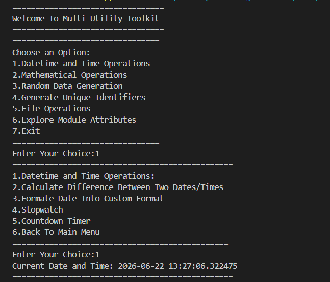

**▶ Format Date Into Custom Format**

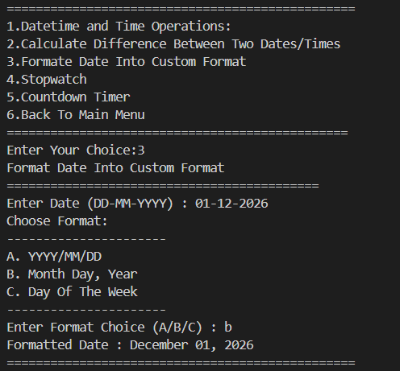

**▶ Countdown Timer**

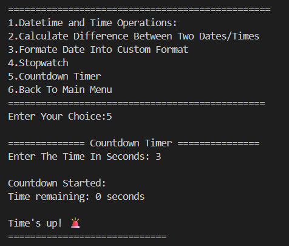

---

## 🧮 Module 2 — Mathematical Operations

> Performs arithmetic, financial, trigonometric, and geometric calculations using the `math` module.

### 📝 Sub-Features

| Option | Function | Description |
|--------|----------|-------------|
| 1 | `factorial_number()` | Computes the factorial of a number |
| 2 | `compound_interest()` | Calculates compound interest from principal, rate & time |
| 3 | `trigonometry()` | Computes sin, cos, and tan for a given angle in degrees |
| 4 | `area_*()` | Computes area of Rectangle, Square, Triangle, or Circle |

**Logic — Compound Interest:**
```python
amount = p * ((1 + r / 100) ** t)
print(f"Compound Interest: {amount:.2f}")
```

**Logic — Trigonometric Calculations:**
```python
rad = math.radians(angle)
print(f"sin({angle}) = {math.sin(rad):.4f}")
print(f"cos({angle}) = {math.cos(rad):.4f}")
print(f"tan({angle}) = {math.tan(rad):.4f}")
```

**Logic — Area of Square:**
```python
s = float(input("Side: "))
print("Area Of Square =", s * s)
```

### 🖼️ Output Screenshots

**▶ Compound Interest**

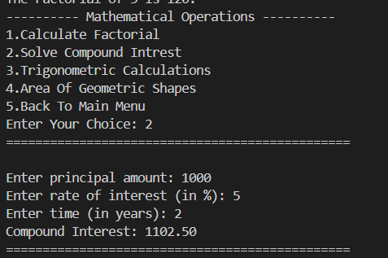

**▶ Trigonometric Calculations**

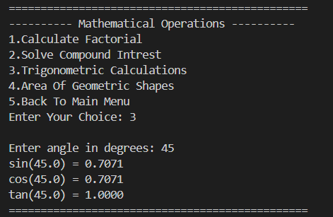

**▶ Area of Geometric Shapes (Square)**

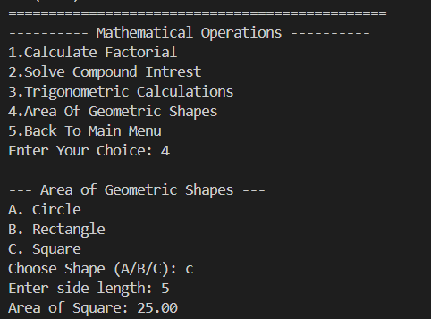

---

## 🎲 Module 3 — Random Data Generation

> Generates random numbers, lists, passwords, and OTPs using the `random` module.

### 📝 Sub-Features

| Option | Function | Description |
|--------|----------|-------------|
| 1 | `random_num()` | Generates a single random number within a range |
| 2 | `random_list()` | Generates a list of random numbers of a given length |
| 3 | `random_password()` | Generates a random alphanumeric + symbol password |
| 4 | `random_OTP()` | Generates a random numeric OTP of a given length |

**Logic — Random List:**
```python
random_list = []
for i in range(length):
    num = random.randint(start, end)
    random_list.append(num)
print(f"Generated Random List: {random_list}")
```

**Logic — Random Password:**
```python
chars = "abcdefghijklmnopqrstuvwxyzABCDEFGHIJKLMNOPQRSTUVWXYZ0123456789@#$!%&*?"
password = "".join(random.choice(chars) for i in range(length))
print(f"Generated Password: {password}")
```

**Logic — Random OTP:**
```python
digits = "0123456789"
otp = "".join(random.choice(digits) for i in range(length))
print(f"Generated Random OTP: {otp}")
```

### 🖼️ Output Screenshots

**▶ Generate Random List**

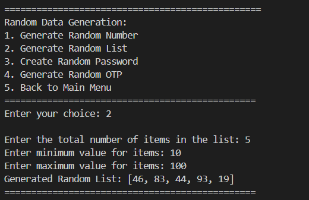

**▶ Create Random Password**

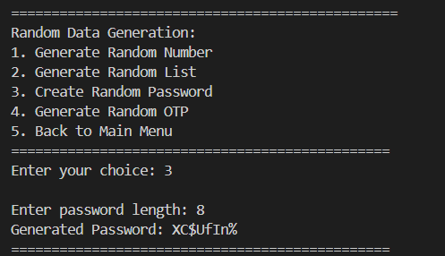

**▶ Generate Random OTP**

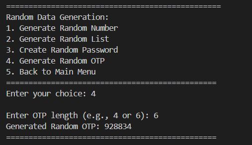

---

## 🆔 Module 4 — Generate Unique Identifiers

> Generates a universally unique identifier (UUID) using Python's built-in `uuid` module.

**Logic:**
```python
import uuid
unique_id = uuid.uuid4()
print(f"Generated UUID: {unique_id}")
```

### 🖼️ Output Screenshot

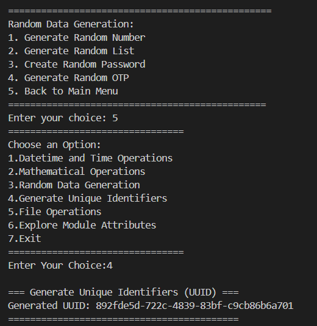

---

## 📁 Module 5 — File Operations

> Handles the complete file lifecycle — create, write, read, and append — using Python's built-in file handling.

### 📝 Sub-Features

| Option | Function | Description |
|--------|----------|-------------|
| 1 | `file_create()` | Creates a new file, with safety check for existing files |
| 2 | `file_write()` | Writes user-provided text into a file (overwrites content) |
| 3 | `file_read()` | Reads and displays the contents of a file |
| 4 | `file_append()` | Appends new text to an existing file on a new line |

**Logic — Create File Safely:**
```python
try:
    with open(filename, "x") as file:
        pass
    print("File created successfully!")
except FileExistsError:
    print("Error: File already exists!")
```

### 🖼️ Output Screenshot

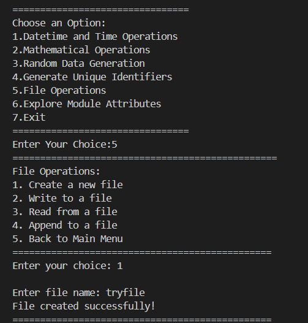

---

## 🔍 Module 6 — Explore Module Attributes

> A handy diagnostic feature that lists every attribute and function available inside a chosen standard-library module using Python's built-in `dir()` function.

**Logic:**
```python
if dir_choice == 3:
    print(f"Attributes of 'random' module:\n{dir(random)}")
```

### 🖼️ Output Screenshot

**▶ Exploring the `random` Module**

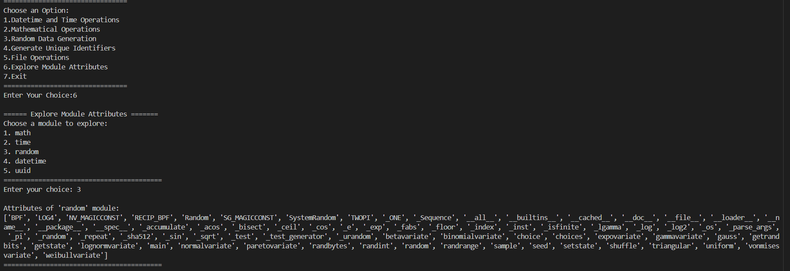

---

## 🚪 Exit Program

> Gracefully breaks out of the infinite `while True` loop and ends the program with a farewell message.

**Logic:**
```python
case 7:
    print("Thank You For Using The Multi-Utility Toolkit!")
    break
```

### 🖼️ Output Screenshot

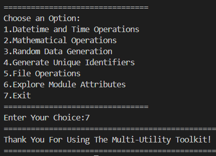

---

## 🛠️ Tech Stack

| Tool | Version | Purpose |
|------|---------|---------|
| 🐍 **Python** | 3.10+ | Core programming language (uses `match-case`) |
| 🕒 **datetime** | Built-in | Date parsing, formatting & difference calculation |
| ⏱️ **time** | Built-in | Stopwatch & countdown timer functionality |
| 🧮 **math** | Built-in | Factorial, trigonometry, geometric area formulas |
| 🎲 **random** | Built-in | Random numbers, lists, passwords & OTPs |
| 🆔 **uuid** | Built-in | Unique identifier generation |
| 📁 **File I/O** | Built-in | `open()` with `x` / `w` / `r` / `a` modes |
| 🔁 **while / match-case** | Built-in | Infinite menu loop & structured branching |

---

## 📈 Results & Insights

After running the program, the following outputs are produced:

- ✅ **6 Fully Functional Modules** — Datetime, Math, Random, UUID, File Ops, Module Explorer
- 🕒 **Live Timers** — Real-time stopwatch and countdown with second-by-second updates
- 🧮 **Accurate Calculations** — Compound interest, trigonometry, and geometric areas computed correctly
- 🔐 **Secure Random Outputs** — Custom-length passwords and OTPs generated on demand
- 📁 **Complete File Lifecycle** — Files can be created, written to, read, and appended without leaving the menu
- ⚠️ **Robust Error Handling** — Invalid menu choices and invalid dates are caught with clear messages

---

## 🏆 Advantages

| Advantage | Detail |
|-----------|--------|
| 🎓 **Beginner Friendly** | Combines loops, conditionals, functions, and modules in one project |
| 🧩 **Modular Design** | Each utility lives in its own file inside `package/` for easy maintenance |
| 🔄 **Reusability** | Every function can be imported and reused independently in other scripts |
| 📚 **Educational** | Demonstrates real use cases for `datetime`, `math`, `random`, `uuid`, and file I/O |
| 🖥️ **No External Dependencies** | Runs with pure Python — only standard library modules used |
| ⚡ **Lightweight** | Small footprint, instantly runnable from any terminal |
| 🧪 **Extensible** | Easy to add new modules (e.g., unit converter, currency calculator) |
| 🛡️ **Input Safety** | Try/except blocks prevent crashes on bad input |

---

## 📄 License

This project is licensed under the **MIT License** — see the [LICENSE](LICENSE) file for full details.

```
MIT License — Free to use, modify, and distribute with attribution.
```

---

## 👤 Author

<div align="center">

### KRINAL DHOLAKIYA

[](https://github.com/krinaldholakiya)

> *"A good toolkit doesn't do one thing well — it does many things, reliably."*

**🎓 Role:** Python Developer | Programming Enthusiast \
**📍 Location:** India \
**🛠️ Skills:** Python · Modular Design · CLI Applications · Standard Library · Logic Building

</div>

---

## 🙏 Acknowledgements

Special thanks to the following resources and communities that made this project possible:

- 📚 [Python Official Docs](https://docs.python.org/3/) — Official Python language reference
- 🕒 [Python `datetime` Docs](https://docs.python.org/3/library/datetime.html) — Date and time handling reference
- 🧮 [Python `math` Docs](https://docs.python.org/3/library/math.html) — Mathematical functions reference
- 🎲 [Python `random` Docs](https://docs.python.org/3/library/random.html) — Random data generation reference
- 🆔 [Python `uuid` Docs](https://docs.python.org/3/library/uuid.html) — Unique identifier reference
- 🖥️ [W3Schools Python](https://www.w3schools.com/python/) — Beginner Python reference
- 💬 [Stack Overflow Community](https://stackoverflow.com/) — Problem-solving support

---

<div align="center">

---

*Made with ❤️ — Last updated: 26 June, 2026*

</div>
