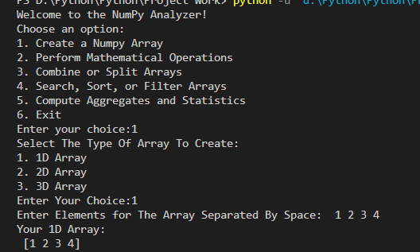
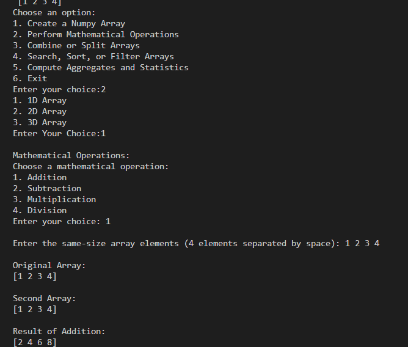
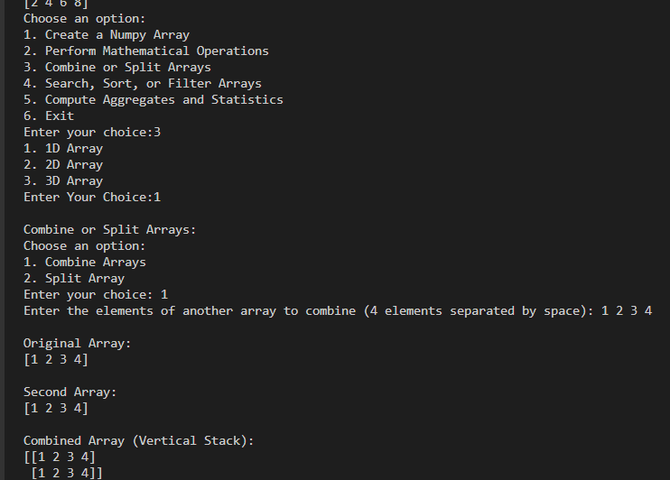
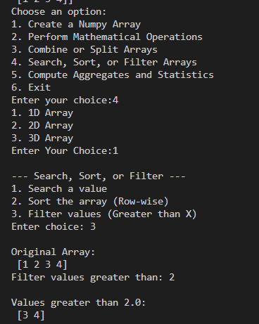
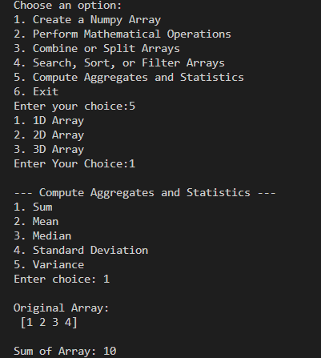
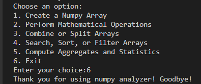

<div align="center">

# -- ! NumPy Analyzer ! --
### *Interactive Console-Based NumPy Array Toolkit*

[](https://www.python.org/)
[](https://numpy.org/)
[](https://www.python.org/)
[](https://www.python.org/)

<br/>

> *"Arrays are the building blocks of data — master NumPy, and numbers become insight."*

</div>

---

## 📋 Table of Contents

- [📌 Overview](#-overview)
- [🎯 Problem Statement](#-problem-statement)
- [✨ Key Features](#-key-features)
- [🏗️ Project Structure](#️-project-structure)
- [🔄 Project Workflow](#-project-workflow)
- [🧩 Part A — Create a NumPy Array](#-part-a--create-a-numpy-array)
- [➕ Part B — Mathematical Operations](#-part-b--mathematical-operations)
- [🔗 Part C — Combine or Split Arrays](#-part-c--combine-or-split-arrays)
- [🔍 Part D — Search, Sort, or Filter Arrays](#-part-d--search-sort-or-filter-arrays)
- [📊 Part E — Compute Aggregates and Statistics](#-part-e--compute-aggregates-and-statistics)
- [🖼️ Program Output — Screenshots](#️-program-output--screenshots)
- [🛠️ Tech Stack](#️-tech-stack)
- [📈 Results & Insights](#-results--insights)
- [🏆 Advantages](#-advantages)
- [📄 License](#-license)
- [👤 Author](#-author)
- [🙏 Acknowledgements](#-acknowledgements)

---

## 📌 Overview

The **NumPy Analyzer** is an interactive Python console application that puts the **NumPy library** front and center. Through a simple menu-driven interface, the user can create 1D, 2D, and 3D arrays, run mathematical operations on them, combine or split arrays, search/sort/filter values, and compute statistical aggregates — all from the terminal.

This project is designed to:
- Strengthen understanding of **NumPy array creation** across dimensions (1D, 2D, 3D)
- Practice **`match-case`** driven menu design in modern Python
- Apply **vectorized arithmetic** (addition, subtraction, multiplication, division) on arrays
- Explore **array manipulation** techniques — stacking, splitting, indexing, and slicing
- Use NumPy's built-in **search, sort, and filter** utilities
- Compute core **statistics** — sum, mean, median, standard deviation, and variance

---

## 🎯 Problem Statement

> **Objective:** Build a console-based interactive tool that lets a user create and analyze NumPy arrays without writing any code themselves.

You are building a hands-on utility for anyone learning NumPy. The program must accept menu choices and execute the corresponding array task — creation, math, combining/splitting, searching/sorting/filtering, or statistical analysis — for arrays of any dimension.

| 📂 Feature | 📄 Type | 🔍 Description |
|------------|---------|----------------|
| Array Creator | Console Input/Output | Builds 1D, 2D, or 3D NumPy arrays from user input |
| Math Engine | Logic | Element-wise Addition, Subtraction, Multiplication, Division |
| Combine/Split | Array Manipulation | Vertical stacking and array splitting |
| Search/Sort/Filter | Logic | Locate values, sort rows, filter by threshold |
| Aggregates & Stats | Logic | Sum, Mean, Median, Standard Deviation, Variance |

The goal is to demonstrate **practical NumPy fluency** through a clean, menu-driven interactive program.

---

## ✨ Key Features

| Feature | Description |
|--------|-------------|
| 🔁 **Infinite Menu Loop** | Program runs continuously until user selects Exit |
| 🧩 **1D / 2D / 3D Array Builder** | Create arrays of any dimension directly from console input |
| ➕ **Element-wise Math** | Addition, Subtraction, Multiplication, and Division between arrays |
| 🔗 **Combine Arrays** | Vertically stack two arrays using `np.vstack()` |
| ✂️ **Split Arrays** | Break an array into smaller sub-arrays |
| 🔍 **Search a Value** | Locate elements using `np.where()` |
| 🔃 **Row-wise Sorting** | Sort array contents using `np.sort()` |
| 🚦 **Threshold Filtering** | Filter elements greater than a given value |
| 📊 **Statistical Aggregates** | Sum, Mean, Median, Standard Deviation, and Variance via NumPy |
| 🖥️ **CLI Interface** | Simple, clean text-based menu for user interaction |
| ✅ **Match-Case Flow** | Fully driven by user input with branching via `match-case` |
| ⚠️ **Invalid Input Handling** | Detects and reports invalid menu or array-type choices |
| 📐 **Index & Slice Support** | Indexing and slicing available for 2D and 3D arrays |

---

## 🏗️ Project Structure

```
📦 numpy-analyzer/
│
├── 📄 pr-8.py                ← Main Python script (entry point)
├── 📄 README.md              ← Project documentation
│
└── 📁 screenshots/           ← Program output screenshots
    ├── 01_create_array.png
    ├── 02_math_operations.png
    ├── 03_combine_split.png
    ├── 04_search_sort_filter.png
    ├── 05_aggregates_statistics.png
    └── 06_exit.png
```

---

## 🔄 Project Workflow

```
Program Start
      │
      ▼
┌───────────────────────────────┐
│      Display Main Menu        │  ← 1-6 Options
└──────────────┬─────────────────┘
               │
   ┌───────┬───┴───┬───────┬───────┐
   ▼        ▼       ▼       ▼       ▼
┌──────┐ ┌──────┐ ┌──────┐ ┌──────┐ ┌────────┐
│  1   │ │  2   │ │  3   │ │  4   │ │   5    │
│Create│ │Math  │ │Combo │ │Search│ │Stats   │
└──┬───┘ └──┬───┘ └──┬───┘ └──┬───┘ └───┬────┘
   │        │        │        │         │
   ▼        ▼        ▼        ▼         ▼
┌───────────────────────────────────────────┐
│      Choose Array Type: 1D / 2D / 3D       │
└──────────────────┬──────────────────────────┘
                    │
                    ▼
┌───────────────────────────────────────────┐
│         Print Result Output to Console      │
└──────────────────┬──────────────────────────┘
                    │
                    ▼
            Loop Back to Menu
                    │
             (Choice: 6) Exit ✅
```

---

## 🧩 Part A — Create a NumPy Array

### 📝 1. What is Array Creation?

The first menu option lets the user build a NumPy array of a chosen dimension directly from console input, converting raw text into a structured `numpy.ndarray`.

---

### 🗺️ 2. Array Types — Overview

| Type | Dimension | Logic Used |
|------|-----------|------------|
| 1️⃣ | **1D Array** | Space-separated input converted into a flat array |
| 2️⃣ | **2D Array** | Row-by-row input assembled into a matrix, with indexing/slicing |
| 3️⃣ | **3D Array** | Block-by-block input assembled into a stack of matrices |

---

### 🔢 3. 1D Array Creation

> Converts a single line of space-separated numbers into a 1D array.

**Logic:**
```python
user_input = input("Enter Elements for The Array Separated By Space:  ")
list_data = [int(x) for x in user_input.split()]
arr_1d = np.array(list_data)
print("Your 1D Array:\n", arr_1d)
```

**Sample Output:**
```
Enter Elements for The Array Separated By Space:  1 2 3 4
Your 1D Array:
 [1 2 3 4]
```

---

### 🧮 4. 2D Array Creation

> Builds a matrix row-by-row, with optional indexing and slicing.

**Logic:**
```python
for i in range(rows):
    row_input = input(f" Enter {i+1} line Elements: ")
    row_data = [int(x) for x in row_input.split()]
    matrix.append(row_data)
arr_2d = np.array(matrix)
```

**Indexing / Slicing:**
```python
print(f"Element at [{r_idx}][{c_idx}] is: {arr_2d[r_idx, c_idx]}")
sliced_array = arr_2d[r_start:r_end, c_start:c_end]
```

---

### 🧊 5. 3D Array Creation

> Builds a stack of 2D blocks (matrices) to form a 3D array.

**Logic:**
```python
for b in range(blocks):
    for r in range(rows):
        row_input = input(f"Enter numbers for Row {r+1}: ")
        row_data = [int(x) for x in row_input.split()]
        block_list.append(row_data)
    main_list.append(block_list)
arr_3d = np.array(main_list)
```

---

## ➕ Part B — Mathematical Operations

### 🔍 6. Element-wise Arithmetic

> Performs Addition, Subtraction, Multiplication, or Division between the created array and a second, same-shaped array.

**Logic:**
```python
second_array = np.array(list_data2).reshape(arr_1d.shape)
result = arr_1d + second_array   # or -, *, /
print("\nResult of Addition:")
print(result)
```

**Key Concepts Used:**

| Concept | Detail |
|---------|--------|
| 🔁 `.reshape()` | Matches the second array to the original array's shape |
| ➕➖✖️➗ Element-wise Ops | Vectorized NumPy arithmetic, no manual loops |
| 🖨️ f-strings | Formatted output prompts for user-friendly input |

**Sample Output (Addition, 1D):**
```
Original Array:
[1 2 3 4]

Second Array:
[1 2 3 4]

Result of Addition:
[2 4 6 8]
```

---

## 🔗 Part C — Combine or Split Arrays

### 🔍 7. Combining & Splitting

> Combines two arrays using vertical stacking, or splits a single array into smaller pieces.

**Logic:**
```python
combined_array = np.vstack((arr_1d, second_array))
print("\nCombined Array (Vertical Stack):")
print(combined_array)
```

**Sample Output:**
```
Original Array:
[1 2 3 4]

Second Array:
[1 2 3 4]

Combined Array (Vertical Stack):
[[1 2 3 4]
 [1 2 3 4]]
```

---

## 🔍 Part D — Search, Sort, or Filter Arrays

### 🔍 8. Search, Sort & Filter

> Locates a specific value, sorts the array row-wise, or filters elements above a given threshold.

**Logic:**
```python
indices = np.where(arr_1d == val)              # Search
sorted_arr = np.sort(arr_1d, axis=-1)          # Sort
filtered = arr_1d[arr_1d > val]                # Filter
```

**Sample Output (Filter > 2):**
```
Original Array:
 [1 2 3 4]
Filter values greater than: 2

Values greater than 2.0:
 [3 4]
```

---

## 📊 Part E — Compute Aggregates and Statistics

### 🔍 9. Statistical Aggregates

> Computes Sum, Mean, Median, Standard Deviation, or Variance for the created array.

**Logic:**
```python
print(f"\nSum of Array: {np.sum(arr_1d)}")
print(f"\nMean of Array: {np.mean(arr_1d)}")
print(f"\nMedian of Array: {np.median(arr_1d)}")
print(f"\nStandard Deviation of Array: {np.std(arr_1d)}")
print(f"\nVariance of Array: {np.var(arr_1d)}")
```

**Key Concepts Used:**

| Concept | Detail |
|---------|--------|
| ➕ `np.sum()` | Total of all elements |
| 📏 `np.mean()` / `np.median()` | Central tendency measures |
| 📉 `np.std()` / `np.var()` | Spread / dispersion measures |

**Sample Output:**
```
Original Array:
 [1 2 3 4]

Sum of Array: 10
```

---

## 🖼️ Program Output — Screenshots

> Real console output captured while running `pr-8.py`, one for each major menu option.

### 1️⃣ Creating a 1D Array


### 2️⃣ Performing Mathematical Operations


### 3️⃣ Combining Arrays


### 4️⃣ Filtering Array Values


### 5️⃣ Computing Aggregates & Statistics


### 6️⃣ Exiting the Program


---

## 🛠️ Tech Stack

| Tool | Version | Purpose |
|------|---------|---------|
| 🐍 **Python** | 3.10+ | Core programming language |
| 🔢 **NumPy** | Latest | Array creation, math, and statistics engine |
| 🔁 **While Loop** | Built-in | Infinite menu loop control |
| 🧭 **match-case** | Python 3.10+ | Structured menu branching |
| 🧮 **Arithmetic Operators** | Built-in | Element-wise addition, subtraction, etc. |
| 🖨️ **print() / input()** | Built-in | Console I/O and user interaction |
| 📐 **f-strings** | Python 3.6+ | Formatted string output |

---

## 📈 Results & Insights

After running the program, the following outputs are produced:

- ✅ **1D / 2D / 3D Array Creation** — Arrays built directly from console input
- ➕ **Element-wise Math** — Addition, Subtraction, Multiplication, and Division between arrays
- 🔗 **Array Combination** — Two arrays vertically stacked into one
- 🔍 **Value Search & Filtering** — Elements located and filtered using NumPy conditions
- 📊 **Full Statistical Suite** — Sum, Mean, Median, Standard Deviation, and Variance computed instantly
- 🔁 **Persistent Menu** — Program loops back after every task until manually exited
- ⚠️ **Error Feedback** — Invalid choices trigger a clear "Invalid choice!" message

---

## 🏆 Advantages

| Advantage | Detail |
|-----------|--------|
| 🎓 **Beginner Friendly** | Core NumPy operations wrapped in a simple menu |
| 🔄 **Reusability** | Array logic can be extracted into reusable functions |
| 📚 **Educational** | Each menu reinforces a different NumPy capability |
| 🖥️ **Single Dependency** | Only requires NumPy — no other external libraries |
| ⚡ **Lightweight** | Single-file script, instantly runnable from any terminal |
| 🧪 **Extensible** | Easy to add new operations (e.g., dot product, reshape) |
| 📖 **Readable Code** | Clear `match-case` structure makes logic easy to follow |
| 🛡️ **Input Safety** | Invalid menu and array-type choices are caught and reported |

---

## 📄 License

This project is licensed under the **MIT License** — see the [LICENSE](LICENSE) file for full details.

```
MIT License — Free to use, modify, and distribute with attribution.
```

---

## 👤 Author

<div align="center">

### KRINAL DHOLAKIYA

[](https://github.com/)


> *"Every array starts with a single element — just like every program starts with a single line."*

**🎓 Role:** Python Developer | Programming Enthusiast \
**📍 Location:** India \
**🛠️ Skills:** Python · NumPy · CLI Applications · Logic Building · Data Analysis

</div>

---

## 🙏 Acknowledgements

Special thanks to the following resources and communities that made this project possible:

- 📚 [NumPy Official Docs](https://numpy.org/doc/) — Official NumPy reference and user guide
- 🐍 [Python Official Docs](https://docs.python.org/3/) — Official Python language reference
- 🔁 [Real Python — NumPy](https://realpython.com/numpy-array-programming/) — In-depth NumPy tutorials
- 🖥️ [W3Schools NumPy](https://www.w3schools.com/python/numpy/) — Beginner NumPy reference
- 🧮 [Python f-strings Guide](https://realpython.com/python-f-strings/) — Formatted string literals
- 💬 [Stack Overflow Community](https://stackoverflow.com/) — Problem-solving support
- 📖 [Kaggle Learn](https://www.kaggle.com/learn) — Python and data analysis courses

---

<div align="center">

---

*Made with ❤️  — Last updated: 07 July, 2026*

</div>
